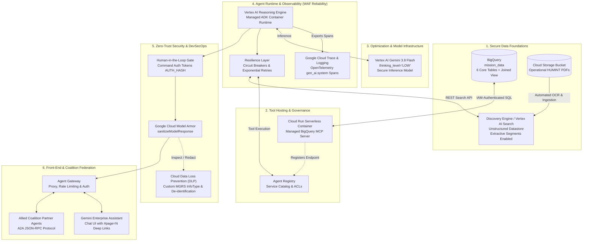

# Intelligence Agent: Multi-Domain Agentic Intelligence Application

**Security Classification:** Demonstrator // REL TO NATO  
**Methodology:** Google Cloud Well-Architected Framework (WAF) for AI/ML Operational Excellence  

## 1. Vision & Scope (The Why)

The Intelligence Agent is a secure Agentic AI ecosystem designed for the UK Ministry of Defence (MOD) Joint Command Staff. It synthesizes structured operational telemetry and unstructured field reports in real-time. By utilizing localized Generative AI foundation models (`gemini-3.8-flash` and `gemini-3.1-pro`), this application transforms multi-domain data—spanning cyber, electronic warfare (EW), radar, satellite reconnaissance, and human intelligence (HUMINT)—into immediate Command and Control (C2) decision advantage.

### Operational Outcomes
*   **C2 Decision Acceleration:** Reduces cross-domain intelligence correlation from hours to seconds (<30s per complex query).
*   **Sub-Second Deterministic Response:** Routine checks resolve via Tier 1 Fast-Path Intercepts in $\le 50\text{ ms}$ at zero token cost.
*   **Command Safety Compliance:** 100% of kinetic and offensive cyber advisories are intercepted by a Human-in-the-Loop (HITL) gate until explicitly authorized.
*   **Analyst Capacity:** Enables a 5x increase in report processing volume without requiring additional headcount.

---

## 2. Architecture & Ecosystem (The What)

The platform is built on Google Cloud Platform (GCP) and utilizes the Google Agent Developer Kit (ADK 2.0), Model Context Protocol (MCP), and Vertex AI.

### Core Design Principles
*   **ReAct Cognitive Loop**: Implements the `Think -> Act -> Observe -> Repeat` paradigm.
*   **Resilience & Governance**: Utilizes 3-state Circuit Breakers (`CLOSED`, `OPEN`, `HALF_OPEN`) with exponential backoff for tool fault tolerance.
*   **3-Tier Memory**:
    1.  *Tier 1 (Working Memory)*: In-flight session history via `VertexAiSessionService`.
    2.  *Tier 2 (Transaction State)*: Request graph execution blackboard.
    3.  *Tier 3 (Long-Term Memory)*: Persistent threat domain mapping across sessions.

---

## 3. Agent Platform & Integrations (The How)

### Vertex AI Reasoning Engine
The application standardizes on **Vertex AI Reasoning Engine** for its managed ADK container runtime. This provides managed auto-scaling, sub-second cold starts, and built-in durable multi-turn session persistence, removing infrastructure toil for stateful enterprise agents.

### Gemini Enterprise & Grounding
The unstructured RAG pipeline leverages Vertex AI Search (Discovery Engine). The Agent Platform securely authenticates via SPIFFE Workload Identity (SVIDs). Extractive segments power precise citations, which natively render in the Gemini Enterprise UI as clickable document chips (`#page=N`), driving users directly to the raw, authenticated PDF hosted in Google Cloud Storage to eliminate hallucinations.

### Zero-Trust & Model Armor
Inline security filters using Google Cloud Model Armor actively monitor inputs and outputs. Sensitive operational data, such as MGRS tactical coordinates or UK National Caveats, are automatically redacted and replaced with tokenized identifiers (`[CUSTOM_MGRS_COORDINATES]`), ensuring safe data flow.

### Coalition Federation (Agent-to-Agent)
A NATO-first intelligence sharing strategy is enabled through an A2A protocol. A secure UK Host Agent processes authenticated JSON-RPC 2.0 requests from Allied Partner Agents, automatically sanitizing outputs to `Demonstrator // REL TO NATO` standards before transmission, allowing real-time federated intelligence sharing across boundaries.

---

## 4. Trainer Scenarios

The Intelligence Agent is validated against three core operational scenarios:

### Scenario 1: Introduction to the Intelligence Agent (End User)
*   **Multi-Domain Reasoning**: Correlates structured BigQuery tracking telemetry (e.g., TRK-901) with unstructured Discovery Engine HUMINT PDFs simultaneously.
*   **Secure Citations**: Demonstrates Gemini Enterprise UX grounding with natively clickable source links preventing hallucination.
*   **Memory Persistence**: Showcases multi-turn conversational context utilizing the ADK memory service.
*   **PII Redaction**: Illustrates Model Armor intercepting sensitive data, redacting PII and Caveats while preserving necessary tactical coordinates for mapping workflows.

### Scenario 2: Observability & FinOps (Operations)
*   **Observability Dashboard**: Monitors Agent Execution Latency and semantic tool traces (`gen_ai.callback.model_armor`, `execute_bigquery_sql`) via OpenTelemetry in Google Cloud Monitoring.
*   **FinOps Governance**: Visualizes token burn (Input vs. Output) preventing loop-thrashing and enabling right-sizing of foundation models based on precise token usage.

### Scenario 3: Security & Working with Partners (SecOps & Coalition)
*   **HITL Command Gates**: Demonstrates the intercept of high-consequence kinetic or offensive cyber strikes requiring cryptographic confirmation tokens.
*   **SPIFFE Authentication**: Validates secure, temporal workload identity access over static service account keys.
*   **NATO A2A Integration**: Executes cross-domain threat assessments between sovereign enclaves, automatically enforcing Model Armor releasability and boundary sanitization policies.
