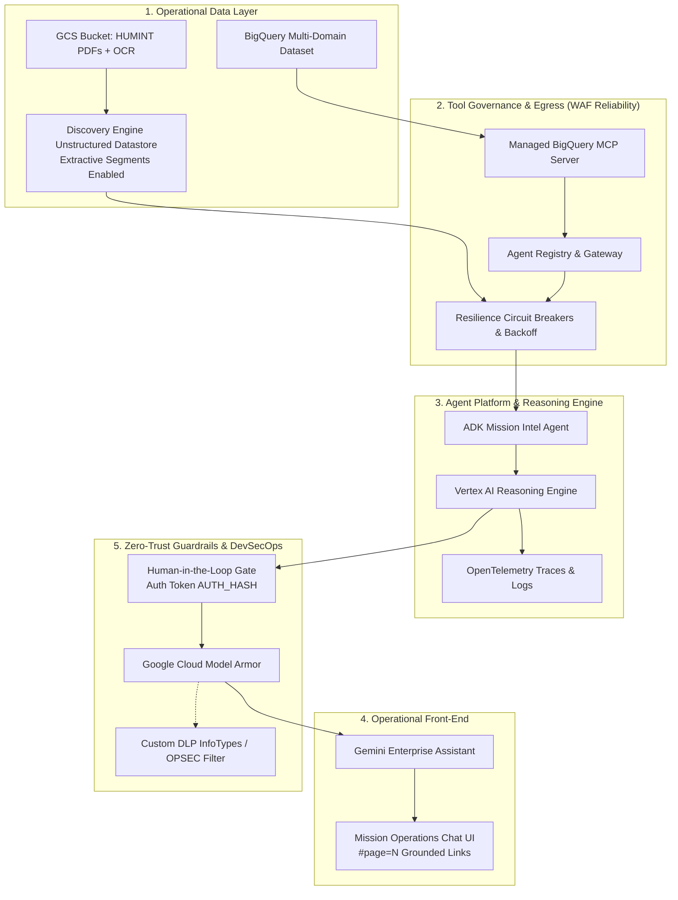

# Multi-Domain Mission Intelligence Agent

Welcome to the **Agentic AI Mission Intelligence Reference Architecture**. This repository contains a comprehensive reference implementation demonstrating how to build, govern, deploy, and operationalize enterprise Agentic AI for the **UK Ministry of Defence (MOD)** and the **Defence Industrial Base (DIB)**. 

### 📚 Executive Briefing
Are you a CTO, Senior Operations Manager, or Technical Leader looking to understand the strategic value and architectural principles behind this architecture? 
👉 **Read the [Executive Briefing: Architecting Enterprise Agentic AI](docs/EXECUTIVE_BRIEFING.md)**

**Strategic Context:** In alignment with the project [Scoping Document](docs/scoping_document.md) and [Implementation Specification](docs/Spec.md), this reference architecture illustrates how to synthesize structured telemetry and unstructured HUMINT field reports to accelerate Command and Control (C2) decision advantage. While this implementation utilizes Google Cloud services, the architecture translates directly to secure enterprise cloud deployments, adhering strictly to **NATO-first** integration and intelligence-sharing doctrine.  
**Security Classification:** Demonstrator  

---

## 🏗️ Architecture & Technical Documentation

For an in-depth breakdown of the software design patterns and cloud infrastructure, refer to the dedicated architecture documents:

*   **[System Architecture](docs/Architecture.md)**: Master TOGAF / WAF system architecture document bridging data, cognitive runtime, MCP, resilience, OPSEC, and coalition federation.
*   **[Security Architecture](docs/Security.md)**: Details the secure cloud topology, including Model Armor OPSEC intercepts, Human-in-the-Loop (HITL) gateways, and Agent Gateway.
*   **[Observability Architecture](docs/Observability.md)**: Details OpenTelemetry instrumentation and Cloud Monitoring dashboards.
*   **[Instructor Storyboard & Playbook](docs/STORYBOARD.md)**: Executive delivery narrative, customer milestones, architectural WAF concepts, and instructor teaching notes.

### High-Level Flow Overview

The architecture integrates **BigQuery**, the **Model Context Protocol (MCP)**, **Agent Registry & Gateway**, **Vertex AI Agent Platform (Reasoning Engine)**, **Circuit Breakers**, **OpenTelemetry**, **Gemini Enterprise**, and **Model Armor**:



---

## ⚡ Enterprise Reliability, Optimization & Safety Suite

The mission intelligence agent implements core enterprise architecture patterns aligned with the **Google Cloud Well-Architected Framework**:

1. **Multi-Tool Resilience & Circuit Breakers (`common/resilience.py`)**:
   * Finite state machine (`CLOSED`, `OPEN`, `HALF_OPEN`) tracking tool health.
   * Trips after 3 consecutive failures with a 30-second cooldown, executing graceful degradation fallbacks.
   * `@retry_with_backoff` decorator transparently retries transient network errors across 3 attempts (1.0s, 2.0s, 4.0s).
2. **Human-in-the-Loop (HITL) Command Gateways (`common/hitl.py`)**:
   * Enforces UK MOD Joint Command doctrine: AI recommends, but only human command staff may authorize.
   * High-consequence kinetic strike advisories and offensive cyber countermeasures are automatically held pending submission of an operational confirmation token (`AUTH_<HASH>`).
3. **Enterprise Grounding with Page-Level PDF Citations**:
   * Discovery Engine `contentSearchSpec` parses `derivedStructData.extractive_segments` to extract page numbers and snippets, adhering to ADK guardrails by omitting backend summaries (`summarySpec`).
   * Yields grounded, verifiable Markdown links (`[HUM-448, Page 2: Target Delta-9](https://storage.cloud.google.com/...#page=2)`) rendering interactive source chips in the Gemini Enterprise UI.
4. **Tier 1 Fast-Path Intercepts (`fast_path_intercept`)**:
   * Intercepts conversational greetings and status queries locally in `< 50ms`, resolving with **0 LLM token cost**.
5. **Model Right-Sizing (`gemini-3.8-flash` & `gemini-3.1-pro`)**:
   * Balances sub-second tool generation speed and tactical responsiveness (Flash) with complex multi-domain reasoning and strategic analysis (Pro).
6. **FinOps Alert Policies (`infrastructure/finops/`)**:
   * Monitors `session_turn_count` and `genai_token_usage` metrics at the per-session and fleet level.
   * Protects the project from agentic cost runaway by alerting on excessive token burn (>250k tokens) or potential infinite ReAct loops (>15 turns per session).

---

## 🧪 Automated Test Suite & Operational Verification

The repository includes a comprehensive, automated test suite in [`src/tests/`](src/tests/) and an end-to-end runner [`src/tests/test_e2e.sh`](src/tests/test_e2e.sh) executing **35 total verification tests** across unit tests, SQL analytical joins, customer prompts, and Cloud Logging telemetry:

```bash
# Execute the 13 unit tests (Offline / Sandboxed)
python3 -m unittest discover -s src/tests -p "test_*.py" -v

# Execute the complete 35-test End-to-End Suite in Mock/Hermetic mode
./src/tests/test_e2e.sh --mock

# Execute live verification against active Google Cloud infrastructure
./src/tests/test_e2e.sh --live
```

### Verification Scorecard & Test Dimensions

| Category | Verification Scope | Test File / Engine | Tests | Status |
|---|---|---|:---:|:---:|
| **Unit: Reliability** | Exponential backoff, Circuit breaker trip to `OPEN`, Graceful degradation | `src/tests/test_resilience.py` | 3 | ✅ PASSED |
| **Unit: Security** | Command hold on kinetic/cyber actions, Token verification, Test bypass | `src/tests/test_hitl.py` | 3 | ✅ PASSED |
| **Unit: Attribution** | Page number parsing, Extractive segment Markdown link with `#page=N` | `src/tests/test_grounding.py` | 4 | ✅ PASSED |
| **Unit: Observability** | OpenTelemetry traces/metrics & prompt/response message logging | `src/tests/test_telemetry.py` | 3 | ✅ PASSED |
| **Integration: SQL** | 4 Multi-domain analytical SQL queries (Radar, EW, Cyber, Assets) | `src/tests/test_prompts.py` | 4 | ✅ PASSED |
| **Interactive Prompts** | 18 Customer prompts across all Scenarios with cross-sensor validation | `src/tests/test_prompts.py` | 18 | ✅ PASSED |
| **Telemetry Log Analysis** | Automated verification of trace IDs, GenAI metrics, and non-elided payloads | `src/common/telemetry_log_analyzer.py` | Audited | ✅ PASSED |
| **Total Automated Coverage** | **Complete Functional, Guardrail & Observability Matrix** | **`test_e2e.sh`** | **35 / 35** | **✅ 100%** |


---

## 🎯 Master Developer Prompt Library

These prompts can be tested locally (`python3 src/agent/agent.py "<PROMPT>"`) or in the **Gemini Enterprise Chat UI**:

👉 **See the full [Test Suite Prompts](docs/Test_Suite_Prompts.md) document.**

---

## ⚡ Quick Start / Prerequisites

> [!WARNING]
> **A Gemini Enterprise License is strictly required** for the interactive Web Chat UI and Reasoning Engine capabilities to function properly. Without this, your users will not be able to interact with the deployed AI agent.

* **Runtime Environment**: Python 3.11+ (`python3 --version`)
* **Google Cloud SDK**: `gcloud` authenticated with active Google Cloud Project
* **Security Context**: Security Classification `Demonstrator`

1. **Run Bootstrap Script**:
   Clone or open the repository in CloudShell, then run `infrastructure/setup.sh` to initialize your environment, set environment variables, enable required GCP APIs, and pre-populate the local database:
   ```bash
   chmod +x infrastructure/setup.sh
   ./infrastructure/setup.sh
   ```
2. **Infrastructure Setup (Terraform)**:
   Navigate to `infrastructure/` and apply Terraform:
   ```bash
   cd infrastructure && terraform init && terraform apply -var="project_id=$PROJECT_ID"
   ```
3. **IAM Permissions**:
   ```bash
   PROJECT_NUMBER=$(gcloud projects describe $PROJECT_ID --format="value(projectNumber)")
   
   # Agent Registry Admin for Reasoning Engine Service Agent
   gcloud projects add-iam-policy-binding $PROJECT_ID \
     --member="serviceAccount:service-${PROJECT_NUMBER}@gcp-sa-aiplatform-re.iam.gserviceaccount.com" \
     --role="roles/agentregistry.admin"

   # AI Platform User for Gemini Enterprise Discovery Engine Service Agent
   gcloud projects add-iam-policy-binding $PROJECT_ID \
     --member="serviceAccount:service-${PROJECT_NUMBER}@gcp-sa-discoveryengine.iam.gserviceaccount.com" \
     --role="roles/aiplatform.user"
   ```
