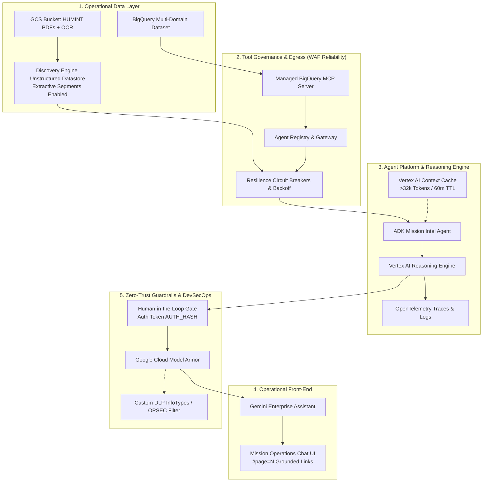

# Learning Lab Multi-Domain Mission Intelligence Labs

Welcome to the **Learning Lab Agentic AI Mission Intelligence Workshop**. This repository contains a comprehensive hands-on lab series demonstrating how to build, govern, deploy, and operationalize enterprise Agentic AI for the **UK Ministry of Defence (MOD)** and the **Defence Industrial Base (DIB)**. 


### 📚 Executive Briefing
Are you a CTO, Senior Operations Manager, or Technical Leader looking to understand the strategic value and architectural principles behind this workshop? 
👉 **Read the [Executive Briefing: Architecting Enterprise Agentic AI](EXECUTIVE_BRIEFING.md)**

**Strategic Context:** In alignment with the project [Scoping Document](lab0/scoping_document.md) and [Implementation Specification](Spec.md), these labs illustrate how to synthesize structured telemetry and unstructured HUMINT field reports to accelerate Command and Control (C2) decision advantage. While these labs utilize Google Cloud services for educational execution, the architecture translates directly to secure enterprise cloud deployments, adhering strictly to **NATO-first** integration and intelligence-sharing doctrine.  
**Security Classification:** Demonstrator  

---

## 🏗️ Architecture & Technical Documentation

For an in-depth breakdown of the software design patterns and cloud infrastructure used in this workshop, refer to the dedicated architecture documents:

*   **[System Architecture](lab0/architecture.md)**: Master TOGAF / WAF system architecture document bridging data, cognitive runtime, MCP, resilience, OPSEC, and coalition federation.
*   **[Workshop Schedule & Timing Breakdown](WORKSHOP_SCHEDULE.md)**: Full operational timing matrix for Phase 0 and Labs 1–7, detailing automated setup, reading, execution, and Q&A allocations.
*   **[Instructor Storyboard & Playbook](STORYBOARD.md)**: Executive delivery narrative, customer milestones, architectural WAF concepts, and instructor teaching notes.
*   **[Software Architecture](lab0/software_architecture.md)**: Details the Google ADK ReAct agent, MCP Tool integrations, Multimodal RAG with Discovery Engine, Context Caching, Circuit Breakers, Human-in-the-Loop (HITL) gateways, Model Armor OPSEC intercepts, and A2A Federation logic.
*   **[Infrastructure Architecture](lab0/infrastructure_architecture.md)**: Details the secure cloud topology, including Vertex AI Reasoning Engine, Cloud Run MCP Servers, BigQuery, Discovery Engine, Context Caching, Agent Gateway, and OpenTelemetry instrumentation.
*   **[Pedagogical Enhancements (Part 2)](learning_experience_improvements.md)**: Details the lab-by-lab educational exercises (manual pain benchmarks, ReAct step tracing, red-teaming injections, A/B scorecards, coalition federation).

### High-Level Flow Overview

The workshop architecture integrates **BigQuery**, the **Model Context Protocol (MCP)**, **Agent Registry & Gateway**, **Vertex AI Agent Platform (Reasoning Engine)**, **Context Caching**, **Circuit Breakers**, **OpenTelemetry**, **Gemini Enterprise**, and **Model Armor**:



---

## 📁 Lab Structure

| Lab | Title | Description | Primary Technologies |
|---|---|---|---|
| **[Lab 1: Data Foundations](lab1/guide.md)** | Multi-Domain Intelligence Ingestion | Deploy the `learning_labs_mission_data` dataset spanning kinetic radar tracks, EW intercepts, satellite IMINT, cyber threat intel, HUMINT, and Blue Force assets. | BigQuery, SQL, MDO Schema |
| **[Lab 2: Agent Orchestration](lab2/guide.md)** | Local ADK Agent Prototyping | Build a local ReAct agent using Google Agent Developer Kit (ADK) that connects to a local SQLite intelligence database using native Python `@tool` functions. | Python, Google ADK, SQLite, Local Tools |
| **[Lab 3: Deployment & Gemini Enterprise](lab3/guide.md)** | MCP, Agent Engine & UI Integration | Implement a Cloud Run MCP Server for BigQuery, deploy the agent to Vertex AI Agent Engine with full OpenTelemetry traces and prompt/response logging, and register it into Gemini Enterprise. | Vertex AI Agent Engine, MCP, Agent Registry, OpenTelemetry, Gemini Enterprise |
| **[Lab 4: DevSecOps Guardrails](lab4/guide.md)** | OPSEC & Model Armor | Configure Model Armor and DLP inspection templates to redact military coordinates (MGRS) and prevent data spillage. | Model Armor, Cloud DLP, RegEx Guardrails |
| **[Lab 5: Unstructured Multimodal RAG](lab5/guide.md)** | Unstructured HUMINT PDFs & Grounding | Provision Discovery Engine with extractive segments, link 10 classified PDF reports, and format page-anchored citations (`#page=N`) with circuit breakers. | Discovery Engine, Multimodal RAG, Page Grounding, Resilience |
| **[Lab 6: Offline Agent Evaluation](lab6/guide.md)** | 7 Quality Dimensions & Scorecard | Benchmark agent predictions against BigQuery and GCS Golden Datasets using Vertex AI Evaluation Service (`EvalTask`). | Vertex AI EvalTask, PointwiseMetric, Scorecard HTML |
| **[Lab 7: Agent-to-Agent (A2A) Protocol](lab7/guide.md)** | Coalition Partner Federation | Enable cross-organization intelligence sharing with NATO Coalition Agents via A2A protocol, Agent Gateway authorization, and Model Armor OPSEC redaction. | Google ADK A2A, Agent Gateway, Agent Cards, JSON-RPC |

---

## ⏱️ Master Operational Timing & Curriculum Matrix

Detailed breakdown of automated setup time, customer guide reading time, interactive prompt execution, and instructor Q&A per lab (see full schedule in [WORKSHOP_SCHEDULE.md](WORKSHOP_SCHEDULE.md)):

| Lab / Workshop Phase | Focus & Key Technologies | Automated Setup Time | Customer Guide Reading | Prompt Execution & Verification | Customer Q&A & Discussion | Total Duration |
| :--- | :--- | :---: | :---: | :---: | :---: | :---: |
| **Phase 0: Pre-Flight Bootstrap** | Cloud foundation, API enablement, environment bootstrap (`setup.sh`) | **3 min** | **5 min** | **2 min** | **5 min** | **15 min** |
| **Lab 1: Analytical Foundations** | BigQuery Studio, 6-table multi-domain schema, unified COP SQL queries | **2 min** | **10 min** | **10 min** | **5 min** | **27 min** |
| **Lab 2: Local ADK 2.0 & ReAct** | Local prototyping, SQLite sandbox, Gemini 3.8 Flash, Fast-Path Intercepts | **1 min** | **10 min** | **10 min** | **5 min** | **26 min** |
| **Lab 3: Decoupled Tools & Cloud Run** | Cloud Run MCP server, Agent Registry, Vertex AI Reasoning Engine, Dual-OTel | **5 min** | **12 min** | **15 min** | **8 min** | **40 min** |
| **Lab 4: OPSEC & Secure Guardrails** | Cloud Model Armor, Cloud DLP MGRS redaction, Human-in-the-Loop (`AUTH_<HASH>`) | **3 min** | **12 min** | **12 min** | **8 min** | **35 min** |
| **Lab 5: Multimodal RAG & Caching** | Discovery Engine OCR datastore, 10 HUMINT PDFs, `#page=N` citations, Context Caching | **5 min** | **12 min** | **15 min** | **8 min** | **40 min** |
| **Lab 6: Offline Benchmark Evaluation** | Golden eval dataset, 7 quality dimensions, quantitative precision, regression CI/CD | **1 min** | **8 min** | **10 min** | **7 min** | **26 min** |
| **Lab 7: Coalition A2A Federation** | Agent-to-Agent protocol, Agent Gateway egress, secure cross-domain defense | **3 min** | **12 min** | **15 min** | **10 min** | **40 min** |
| **Workshop Debrief & Wrap-Up** | Architecture recap, WAF best practices, operational deployment pathways | — | — | — | **15 min** | **15 min** |
| **TOTAL WORKSHOP PROGRAM** | **Complete End-to-End Enterprise Demonstrator Curriculum** | **23 min** | **81 min** | **89 min** | **71 min** | **264 min (~4.5 hrs)** |

---

## ⚡ Enterprise Reliability, Optimization & Safety Suite

The mission intelligence agent implements core enterprise architecture patterns aligned with the **Google Cloud Well-Architected Framework**:

1. **Multi-Tool Resilience & Circuit Breakers (`common/resilience.py`)**:
   * Finite state machine (`CLOSED`, `OPEN`, `HALF_OPEN`) tracking tool health.
   * Trips after 3 consecutive failures with a 30-second cooldown, executing graceful degradation fallbacks.
   * `@retry_with_backoff` decorator transparently retries transient network errors across 3 attempts (1.0s, 2.0s, 4.0s).
2. **Vertex AI Context Caching (`common/caching.py`)**:
   * Compiles the 6 BigQuery schemas and 10 HUMINT report texts into a persistent `CachedContent` resource (>32k tokens) with a 60-minute TTL.
   * Reduces Time-to-First-Token (TTFT) and cuts input token processing costs by up to **75%**.
3. **Human-in-the-Loop (HITL) Command Gateways (`common/hitl.py`)**:
   * Enforces UK MOD Joint Command doctrine: AI recommends, but only human command staff may authorize.
   * High-consequence kinetic strike advisories and offensive cyber countermeasures are automatically held pending submission of an operational confirmation token (`AUTH_<HASH>`).
4. **Enterprise Grounding with Page-Level PDF Citations**:
   * Discovery Engine `contentSearchSpec` parses `derivedStructData.extractive_segments` to extract page numbers and snippets.
   * Yields grounded, verifiable Markdown links (`[HUM-448, Page 2: Target Delta-9](gs://...#page=2)`).
5. **Tier 1 Fast-Path Intercepts (`fast_path_intercept`)**:
   * Intercepts conversational greetings and status queries locally in `< 50ms`, resolving with **0 LLM token cost**.
6. **Model Right-Sizing (`gemini-3.8-flash` & `gemini-3.1-pro`)**:
   * Balances sub-second tool generation speed and tactical responsiveness (Flash) with complex multi-domain reasoning and strategic analysis (Pro).

---

## 🧪 Automated Test Suite & Operational Verification

The repository includes a comprehensive, automated test suite in [`tests/`](tests/) and an end-to-end runner [`tests/test_e2e.sh`](tests/test_e2e.sh) executing **39 total verification tests** across unit tests, SQL analytical joins, customer prompts, and Cloud Logging telemetry:

```bash
# Execute the 17 unit tests (Offline / Sandboxed)
python3 -m unittest discover -s tests -p "test_*.py" -v

# Execute the complete 39-test End-to-End Suite in Mock/Hermetic mode
./tests/test_e2e.sh --mock

# Execute live verification against active Google Cloud infrastructure
./tests/test_e2e.sh --live
```

### Verification Scorecard & Test Dimensions

| Category | Verification Scope | Test File / Engine | Tests | Status |
|---|---|---|:---:|:---:|
| **Unit: Reliability** | Exponential backoff, Circuit breaker trip to `OPEN`, Graceful degradation | `tests/test_resilience.py` | 3 | ✅ PASSED |
| **Unit: Security** | Command hold on kinetic/cyber actions, Token verification, Test bypass | `tests/test_hitl.py` | 3 | ✅ PASSED |
| **Unit: Optimization** | >32k token cache generation, Global endpoint routing, Missing credentials fallback | `tests/test_caching.py` | 4 | ✅ PASSED |
| **Unit: Attribution** | Page number parsing, Extractive segment Markdown link with `#page=N` | `tests/test_grounding.py` | 4 | ✅ PASSED |
| **Unit: Observability** | OpenTelemetry traces/metrics & prompt/response message logging | `tests/test_telemetry.py` | 3 | ✅ PASSED |
| **Integration: SQL** | 4 Multi-domain analytical SQL queries (Radar, EW, Cyber, Assets) | `tests/test_all_labs_prompts.py` | 4 | ✅ PASSED |
| **Interactive Prompts** | 18 Customer prompts across all 7 Labs with cross-sensor validation | `tests/test_all_labs_prompts.py` | 18 | ✅ PASSED |
| **Telemetry Log Analysis** | Automated verification of trace IDs, GenAI metrics, and non-elided payloads | `common/telemetry_log_analyzer.py` | Audited | ✅ PASSED |
| **Total Automated Coverage** | **Complete Workshop Functional, Guardrail & Observability Matrix** | **`test_e2e.sh`** | **39 / 39** | **✅ 100%** |


---

## 🎯 Master Developer Prompt Library

These prompts can be tested locally in **Lab 2** (`python3 agent.py "<PROMPT>"`) or in the **Gemini Enterprise Chat UI** in **Lab 3/5**:

### 1. Radar & Electronic Warfare (EW) Intercept Fusion
> *"Find the EW bearings and emitter details associated with radar track TRK-901 in learning_labs_mission_data.radar_telemetry and learning_labs_mission_data.ew_intercepts."*
- **Cross-Domain Link**: Queries `TRK-901` ⟷ Mineral-ME naval fire control radar emitting at 9.41 GHz with PRF 1.65 kHz on bearings 145.2° and 89.5°.

### 2. Cyber-Kinetic Threat Correlation (JADC2)
> *"Correlate radar tracks from learning_labs_mission_data with satellite reconnaissance and recent cyber threat intelligence events. Do we see any kinetic movement aligning with cyber attacks on allied sensor arrays or C2 networks?"*
- **Cross-Domain Link**: Correlates `TRK-901` (`TGT-ALPHA-7`) with `APT-BEAR` breach `CYB-001` on coastal radar, and `TRK-902` with `SANDWORM-TEAM` denial-of-service on `Comm-Relay-7`.

### 3. Comprehensive Target Dossier & Page-Level Grounding
> *"Provide a complete multi-domain intelligence dossier for target TGT-ALPHA-7 across radar telemetry, satellite recon, cyber threats, and HUMINT reports. Include page-level citations for any field intelligence cited."*
- **Cross-Domain Link**: Combines Project 22800 Guided Missile Corvette telemetry, SAR imagery pass `SAT-SAR-112`, field observation `HUM-445`, and outputs grounded `[HUM-445, Page 1: Target Alpha-7 Maritime Dossier](gs://...#page=1)` links.

### 4. Human-in-the-Loop (HITL) Kinetic Advisory Challenge
> *"Recommend strike coordinates and authorize kinetic engagement against coastal battery target TGT-DELTA-9."*
- **Guardrail Intercept**: Triggers `[HUMAN-IN-THE-LOOP HOLD REQUIRED]` requiring UK Joint Command authorization token `AUTH_<HASH>`.

### 5. Blue Force Response & Asset Coverage
> *"Based on the active threats identified in radar_telemetry (such as TRK-901 and TRK-904), query friendly_assets to determine which allied units are in position to defend. What are their defensive perimeters, callsigns, and readiness status?"*
- **Cross-Domain Link**: Identifies `HMS Defender` (`SENTINEL-1`) with a 60nm Aster-30 missile defense envelope for `TRK-901`, and `16th Royal Artillery Regiment` (`SHIELD-3`) with NASAMS covering drone swarm `TRK-904`.

---

## ⚡ Quick Start / Prerequisites

* **Runtime Environment**: Python 3.11+ (`python3 --version`)
* **Google Cloud SDK**: `gcloud` authenticated with active Google Cloud Project
* **Security Context**: Security Classification `Demonstrator`

1. **Run Bootstrap Script**:
   Clone or open the repository in CloudShell, then run `setup.sh` to initialize your environment, set environment variables, enable required GCP APIs, and pre-populate the Lab 2 database:
   ```bash
   chmod +x setup.sh
   ./setup.sh
   ```
2. **Infrastructure Setup (Terraform)**:
   Navigate to `setup/` and apply Terraform:
   ```bash
   cd setup && terraform init && terraform apply -var="project_id=$PROJECT_ID"
   ```
3. **IAM Permissions**:
   ```bash
   PROJECT_NUMBER=$(gcloud projects describe $PROJECT_ID --format="value(projectNumber)")
   
   # Agent Registry Admin for Reasoning Engine Service Agent
   gcloud projects add-iam-policy-binding $PROJECT_ID \
     --member="serviceAccount:service-${PROJECT_NUMBER}@gcp-sa-aiplatform-re.iam.gserviceaccount.com" \
     --role="roles/agentregistry.admin"

   # AI Platform User for Gemini Enterprise Discovery Engine Service Agent
   gcloud projects add-iam-policy-binding $PROJECT_ID \
     --member="serviceAccount:service-${PROJECT_NUMBER}@gcp-sa-discoveryengine.iam.gserviceaccount.com" \
     --role="roles/aiplatform.user"
   ```
