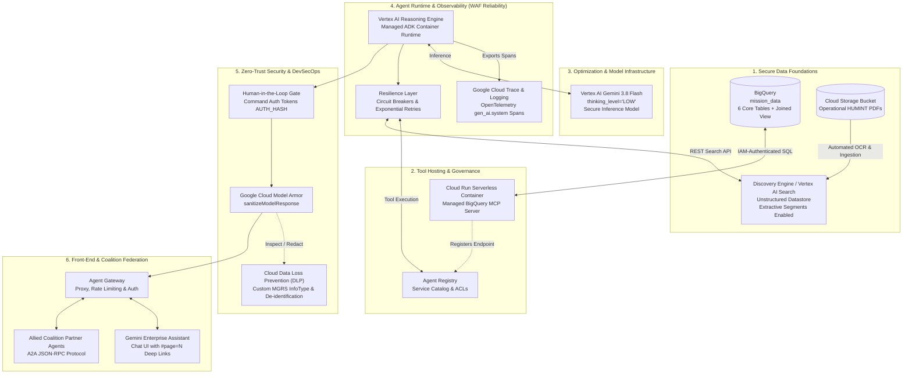

# Architecture

## Executive Summary & Ecosystem
The Mission Intelligence Agentic Platform is a demonstrator application deployed on Google Cloud Platform (GCP). It integrates the Google Agent Developer Kit (ADK 2.0), Model Context Protocol (MCP), and Vertex AI to deliver a multi-domain intelligence analysis capability. Designed for Joint Command Staff, the platform operates across 3-tier memory structures and leverages high-performance Reasoning Engines (Gemini 3.8 Flash / Gemini 3.1 Pro) for secure, deterministic workflows.

## Infrastructure Topology

## Software Layers & Topology
The platform utilizes a robust software architecture built around the ReAct Cognitive Loop, optimizing reasoning speed and accuracy through ADK 2.0 primitives.

- **ReAct Cognitive Loop**: Implements the `Think -> Act (Call Tool) -> Observe (Read Output) -> Repeat` cycle. 
- **Tier 1 Fast-Path Intercepts**: Implementing deterministic pre-LLM regex and token interceptors that resolve routine status checks, greetings, and system readiness queries in $\le 50\text{ ms}$ with zero token consumption.
- **Resilient Tool Egress**: Protects outbound connections to BigQuery, Discovery Engine, and Model Armor using in-memory circuit breakers with exponential retries (1.0s, 2.0s, 4.0s) and a 3-state Circuit Breaker (`CLOSED`, `OPEN`, `HALF_OPEN`).
- **3-Tier Memory Architecture**:
  1. **Tier 1 (Working Memory)**: `VertexAiSessionService` maintaining in-flight session history and token window budgets.
  2. **Tier 2 (Transaction State)**: `MissionTransactionState` acting as a shared blackboard across the request graph execution, passing intermediate tool outputs downstream.
  3. **Tier 3 (Long-Term Memory)**: Persistent `GroupMemoryProfile` stored in `.adk/memory_bank.json` mapping persistent group attributes like threat domains (EW, CYBER, AIR_DEFENSE) across sessions.

## Deployment & Control Plane
ADK provides zero-logic-change portability across runtimes. This project standardizes on **Vertex AI Reasoning Engine** for managed sessions and fast cold-starts.

| Dimension | Agent Runtime (Vertex AI Reasoning Engine) | Cloud Run | Google Kubernetes Engine (GKE) | Gemini Enterprise (No-Code UI) |
| :--- | :--- | :--- | :--- | :--- |
| **CLI Deploy Command** | `adk deploy agent_engine` | `adk deploy cloud_run` | Containerize + `kubectl apply` | UI Wizard |
| **Session & Memory Persistence** | **Built-in (`VertexAiSessionService`)** — durable multi-turn state across days/restarts. | **In-memory by default** (lost on container scale-down) *unless* paired with `--agent_engine_id` (Hybrid mode). | Self-managed (AlloyDB / Firestore). | Fully managed by Google. |
| **Scaling & Cold Starts** | Managed auto-scaling; **sub-second cold starts**. | Scales to zero; fast container cold starts on wake. | Pod HPA / Node Auto-provisioning; full control. | Serverless SaaS. |
| **Billing Model** | **Per vCPU-hour + GB-hour** while instances are active. | **Pay-per-use** (request time / CPU allocation; $0 when scaled to zero). | Cluster node/pod compute cost. | Per-seat license. |
| **Ideal Use Case** | Stateful, multi-turn enterprise agents needing managed sessions, identity, and zero infra toil. | Stateless or bursty/spiky agent workloads, or **Hybrid mode**. | Custom GPU/TPU hardware, open-weight self-hosted models, strict networking. | Business users building simple grounded Q&A assistants. |

## Enterprise Grounding
The RAG pipeline is powered by Vertex AI Search / Discovery Engine acting as an unstructured datastore for operational HUMINT PDFs.
- **SPIFFE Workload Identity Resolution**: The Agent Platform securely authenticates to Discovery Engine via the native SDK, which automatically handles mTLS certificate exchange and correctly binds the Agent's identity via Workload Identity (SVIDs), replacing manual REST auth.
- **Extractive Segments**: Extractive segments are enabled in the backend datastore settings, returning precise, verifiable sentence-level snippets from the original reports (omitting duplicate backend LLM summaries for ADK performance compliance).
- **Native Gemini Citations**: Grounding citations are formatted to output direct authenticated object URIs (`https://storage.cloud.google.com/bucket/file`) and include document page anchors (e.g., `#page=N`), ensuring that generated responses inside the Gemini Enterprise Chat UI natively render interactive, clickable source chips for verification.
