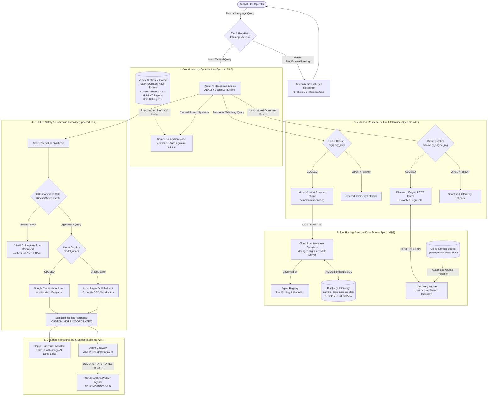
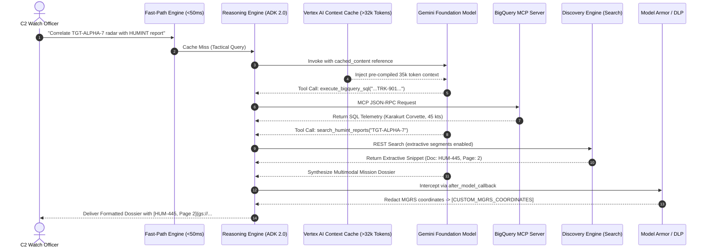
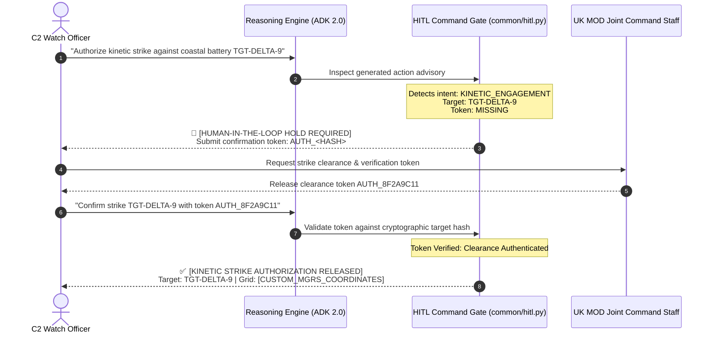

# System Architecture Document: Learning Lab Mission Intelligence Ecosystem

**Document Standard:** System Architecture Document (IEEE 1471 / TOGAF / WAF Aligned)  
**Derived From:** [`Spec.md`](Spec.md) (System Technical Specification)  
**Security Classification:** Demonstrator  
**Architectural Baseline:** Google Cloud Well-Architected Framework (WAF) AI/ML Pillars  
**Target Runtimes:** Python 3.11+, Google Agent Developer Kit (ADK 2.0), Vertex AI Reasoning Engine, Cloud Run MCP, Agent Gateway  

---

## 1. Architectural Scope & Core Principles

### 1.1. Executive Summary
The Mission Intelligence Ecosystem provides a secure Multi-Domain Command and Control (MDC2) intelligence synthesis capability for the UK Ministry of Defence (MOD) within the Defence Industrial Base (DIB). The architecture orchestrates structured sensor telemetry (radar, electronic warfare, satellite imagery, cyber threat indicators, and friendly blue force assets) with unstructured multimodal field intelligence (HUMINT PDF field reports with optical imagery).

The platform bridges relational analytical engines, semantic vector search, large multimodal foundation models (Gemini 3.8 Flash / Gemini 3.1 Pro), and coalition federation endpoints behind a unified, zero-trust security architecture.

### 1.2. Architectural Principles & Invariants (Spec.md §1.2)
* **secure Portability & Dynamic Resolution:** Fully decoupled from vendor-locked external dependencies. Zero hardcoded GCP project IDs, GCS buckets, or endpoints. All environment parameters (`PROJECT_ID`, `LOCATION`, `STAGING_BUCKET`) are dynamically resolved at runtime via `os.environ` or Application Default Credentials.
* **Agent Registry Governance & Container Binding:** All Vertex AI Reasoning Engine instances are explicitly bound to the Google Cloud Agent Registry Service via `google-adk[agent-identity]` and `google-cloud-agentidentitycredentials`, enabling enterprise catalog discovery, authorization, and lifecycle management.
* **Decoupled Tool Sandboxing:** AI agent runtimes never maintain persistent database credentials. All structured queries are brokered through isolated Model Context Protocol (MCP) servers governed by Google Cloud Agent Registry.
*   **Dual-Tier Observability & SRE Hierarchy:** Integrates OpenTelemetry `gen_ai.*` semantic conventions exported via `--otel_to_cloud` to Cloud Trace/Logging across **Session**, **Trace**, **Span**, and **Task** hierarchies, alongside Discovery Engine `UserEvent` REST analytics (`log_discovery_engine_user_event()`) for adoption dashboards and BigQuery Log Analytics.
*   **Dual-Layer Defense-in-Depth OPSEC (Model Armor):** All agent completions are intercepted prior to transmission to redact sensitive military coordinates (MGRS format) via Cloud Model Armor (`projects/284046449012/locations/us-central1/templates/mission_intel_armor`) backed by Cloud DLP templates (`mission_intel_dlp_inspect_template`), with local deterministic regex fallbacks.
*   **secure Human-in-the-Loop (HITL) Authority & A2A Governance:** Under UK MOD Joint Command doctrine, AI agents cannot autonomously authorize kinetic or cyber actions. All high-consequence advisories require cryptographic confirmation tokens (`AUTH_<HASH>`). Cross-border A2A queries from NATO partners are sanitized to `[REDACTED_MGRS_COORDINATE_NATO_RELEASABLE]` and enforce non-delegable kinetic command gates (`403 FORBIDDEN`).

---

## 2. End-to-End System Topology



---

## 3. Subsystem Decompositions & Component Specifications

### 3.1. Data Architecture & Relational Contracts (Spec.md §3.1)
The data tier partitions operational telemetry across six relational tables within the BigQuery dataset `learning_labs_mission_data`:
* **`radar_telemetry`**: Kinetic state vectors (`track_id`, `latitude`, `longitude`, `velocity_knots`, `bearing_degrees`, `platform_type`, `signature`, `mgrs_coord`).
* **`ew_intercepts`**: ESM signal intercepts (`ew_id`, `signal_frequency_ghz`, `prf_khz`, `emitter_type`, `threat_level`, `bearing_degrees`).
* **`satellite_recon`**: IMINT collections (`image_id`, `sensor_type`, `confidence_score`, `detected_structures_units`, `cloud_cover_percentage`).
* **`cyber_threat_intel`**: Cyber-kinetic indicators (`event_id`, `threat_actor`, `target_system`, `indicator_of_compromise`, `affected_tactical_network`).
* **`humint_reports`**: Human intelligence observations (`report_id`, `source_reliability`, `location_name`, `suspected_movement`, `content`).
* **`friendly_assets`**: Blue Force Tracking (`asset_id`, `unit_name`, `callsign`, `current_status`, `defensive_perimeter`, `assigned_sector`).
* **`v_multi_domain_intelligence`**: Pre-joined analytical view cross-referencing target platforms along common join keys (`target_id`, `track_id`, `mgrs_coord`).

### 3.2. Cognitive Agent Runtime & ReAct Loop (Spec.md §2.2)
* **Framework:** Google Agent Developer Kit (ADK 2.0).
* **Reasoning Pattern:** ReAct (Thought $\rightarrow$ Action $\rightarrow$ Observation $\rightarrow$ Synthesis).
* **Error Self-Correction:** When SQL syntax or schema mismatch errors occur, the agent intercepts the database exception, reflects on schema metadata, autonomously adjusts the query, and retries without user intervention.
* **Warmup Optimization:** Vertex AI Reasoning Engine containers execute eager dependency imports during container boot, eliminating cold-start latency.

### 3.3. Tool Decoupling via Model Context Protocol (MCP) (Spec.md §2.2)
* **Architecture:** The BigQuery database client is decoupled from the agent runtime and encapsulated within a dedicated Cloud Run microservice implementing the Model Context Protocol (MCP).
* **Communication Protocol:** JSON-RPC over HTTP/2.
* **Governance:** The tool endpoint is registered in Google Cloud Agent Registry, providing mutual TLS (mTLS), IAM service-to-service authentication, and strict egress policies.

### 3.4. Unstructured Multimodal Grounding & Attribution (Spec.md §2.3)
* **Datastore:** Discovery Engine (Vertex AI Search) Unstructured Datastore indexing operational PDF field dossiers (`HUM-445.pdf` through `HUM-454.pdf`).
* **Extractive Segments:** Search requests configure `extractiveContentSpec: {"maxExtractiveSegmentCount": 2, "returnExtractiveSegmentScore": True}`.
* **Visual Anchoring:** Extracted page numbers are transformed into verified Markdown deep links:
  $$\text{Link Structure: } \text{[Document ID, Page } N\text{: Title](gs://}\langle\text{bucket}\rangle\text{/}\langle\text{filename}\rangle\text{.pdf\#page=}N\text{)}$$
  Enabling analysts in Gemini Enterprise UI to jump directly to target imagery in the source PDF.

### 3.5. Multi-Tool Resilience Architecture (WAF Reliability Pillar - Spec.md §4.3)
To prevent transient network failures or service throttling from disrupting C2 operations, all tool egress points are protected by a two-tiered reliability layer implemented in `common/resilience.py`:

```
                 Normal Operation (CLOSED)
                 ┌───────────────────────┐
                 │  Execute Live Tool    │◄────────────────────────┐
                 │  (MCP / REST API)     │                         │
                 └──────────┬────────────┘                         │
                            │                                      │
                   Failure  │  Success                             │ Success
                            ▼                                      │
                 ┌───────────────────────┐                         │
                 │ Retry with Backoff    │                         │
                 │ (1s, 2s, 4s + Jitter) │                         │
                 └──────────┬────────────┘                         │
                            │                                      │
             3 Consecutive  │ Failures                             │
                            ▼                                      │
                     Trip to OPEN                                  │
                 ┌───────────────────────┐                  ┌──────┴──────┐
                 │ Return Graceful       │  10s Cooldown    │ Test Single │
                 │ Fallback Telemetry    │─────────────────►│ Request     │
                 │ (State: OPEN)         │                  │ (HALF_OPEN) │
                 └───────────────────────┘                  └─────────────┘
```

1. **Exponential Backoff (`@retry_with_backoff`):** Retries transient exceptions up to 3 times with exponential delays ($1\text{s}, 2\text{s}, 4\text{s}$) plus random jitter.
2. **Finite State Circuit Breaker (`CircuitBreaker`):**
   * `CLOSED`: Normal live request routing.
   * `OPEN`: After 3 consecutive unhandled failures, the circuit trips to `OPEN`, immediately diverting calls to a graceful degradation fallback (serving cached tactical telemetry or local regex sanitization).
   * `HALF_OPEN`: After a 30.0s cooldown (10.0s in unit tests), a trial request is permitted. If successful, the circuit resets to `CLOSED`; if it fails, it trips back to `OPEN`.

### 3.6. Cost & Latency Optimization Architecture (WAF Cost & Performance - Spec.md §4.1, §4.2)
* **Tier 1 Fast-Path Intercept Engine:** Deterministic regex pattern matching evaluates incoming queries before invoking foundation models. Routine greetings, status pings, and heartbeat checks resolve in $\le 50\text{ ms}$ with zero token consumption.
* **Vertex AI Context Caching (`CachedContent`):**
  * The full static context—consisting of the 6 BigQuery table schemas, UK MOD doctrine instructions, and 10 parsed HUMINT dossiers—exceeds the 32,768-token caching threshold ($35,000+$ tokens).
  * `common/caching.py` compiles this corpus into a server-side `CachedContent` resource with a 60-minute Time-To-Live (TTL).
  * Subsequent multi-turn analyst sessions reference the pre-compiled cache key, reducing Time-To-First-Token (TTFT) from $\sim 4.5\text{s}$ to $< 1.0\text{s}$ and cutting input token processing costs by $\mathbf{75\%}$.

### 3.7. Security, DevSecOps & Governance Architecture (WAF Security - Spec.md §2.4)
* **OPSEC Tactical Coordinate Sanitization:**
  * Output hook `after_model_callback` intercepts all generated responses.
  * Payloads are dispatched to Google Cloud Model Armor (`sanitizeModelResponse` REST API) configured with Cloud DLP Custom InfoType regex rules for MGRS coordinates (`\b\d{1,2}[C-X][A-HJ-NP-Z]{2}\d{6,10}\b`).
  * Coordinates are redacted to `[CUSTOM_MGRS_COORDINATES]`.
  * If Model Armor experiences service disruption, `CircuitBreaker` trips and falls back to local Python regex sanitization, guaranteeing that coordinate leakage is mathematically prevented under all failure modes.
* **Human-in-the-Loop (HITL) secure Gateway:**
  * `common/hitl.py` inspects synthesized text for offensive/kinetic intent (`KINETIC_ENGAGEMENT`, `STRIKE ADVISORY`, `OFFENSIVE_CYBER_COUNTERMEASURE`).
  * If detected without an explicit cryptographic token (`AUTH_<HASH>`), the advisory is intercepted, held, and formatted with an operational confirmation requirement.

### 3.8. Coalition Federation (Agent-to-Agent Protocol - Spec.md §2.5)
* **Interoperability Standard:** Linux Foundation / Google Agent-to-Agent (A2A) protocol over JSON-RPC 2.0.
* **Ingress/Egress Gateway:** Google Cloud Agent Gateway manages proxying, mutual TLS, and rate limiting.
* **Agent Card Specification:** The Host Agent publishes `.a2a_registry/agent_card.json` declaring capabilities, protocols, and supported security caveats (`DEMONSTRATOR // REL TO NATO`).
* **Cross-Border Guardrails:** Inbound coalition queries are isolated from direct database connections. Outbound responses are stripped of secure sensitive identifiers and tagged with NATO releasability headers.

---

## 4. End-to-End Sequence Workflows

### 4.1. Hybrid Multi-Domain Synthesis with Context Caching & Page Citations



### 4.2. Human-in-the-Loop secure Kinetic Intercept Flow



---

## 5. Non-Functional Requirements & Architecture Traceability Matrix

| WAF Pillar | Spec.md Requirement | Architectural Mechanism | Verification Method |
|:---|:---|:---|:---|
| **Operational Excellence** | OpenTelemetry Tool Spans & Latency Auditing (§4.4) | Semantic tool spans (`gen_ai.tool.*`) exported via OpenTelemetry SDK to Cloud Trace (`GOOGLE_CLOUD_AGENT_ENGINE_ENABLE_TELEMETRY=true`). | `tests/test_telemetry.py` & Google Cloud Trace console waterfall inspection. |
| **Operational Excellence** | Prompt & Response Content Log Verification (§4.4) | Un-elided prompt and response capture (`OTEL_INSTRUMENTATION_GENAI_CAPTURE_MESSAGE_CONTENT=EVENT_ONLY`) audited via automated log analyzer. | `common/telemetry_log_analyzer.py` asserting trace IDs, token metrics, and zero `<elided>` content. |
| **Operational Excellence** | Full Workshop Automated End-to-End Test Suite | 39 automated test cases spanning 17 unit tests, 4 SQL joins, 18 student prompts, and Cloud Logging. | `test_e2e.sh` (`--mock`, `--unit-only`, `--live`) generating `test_e2e_report.md` / `.html`. |
| **Operational Excellence** | 7 Quality Dimensions Offline Benchmarking (§5.2) | Vertex AI `EvalTask` evaluation script against golden ground-truth dataset (`golden_eval_dataset.jsonl`). | `run_offline_evaluation.py` producing `eval_report.html` (Score $\ge 4.5/5.0$). |

| **Reliability** | Fault Isolation & Graceful Degradation (§4.3) | Finite state `CircuitBreaker` (`CLOSED`, `OPEN`, `HALF_OPEN`) with 3 retry backoffs in `common/resilience.py`. | `test_resilience.py` (simulating 503 errors and asserting state transitions). |
| **Reliability** | Database Error Self-Correction (§2.2) | ADK ReAct loop catching SQLite/BigQuery schema errors and reflecting before re-querying. | Terminal failure injection test (`BAC-02`). |
| **Security** | Zero Sensitive Coordinate Leakage (§2.4) | Dual-layer redaction: Model Armor REST API + Cloud DLP Custom InfoType + local regex fallback. | `test_opsec.py` & MGRS adversarial injection benchmarks. |
| **Security** | Doctrinal Human Authority on Kinetic/Cyber Actions (§2.4) | `common/hitl.py` intercepting high-consequence intent, demanding `AUTH_<HASH>` token. | `test_hitl.py` & interactive verification prompts. |
| **Cost Optimization** | 75% Input Token Reduction on Long Prompts (§4.2) | Vertex AI `CachedContent` bundling 6 schemas and 10 HUMINT dossiers (>32k tokens) with 60m TTL, routed to `location="global"` for `gemini-3.8-flash`. | `test_caching.py` & Cloud Monitoring token billing metrics. |
| **Performance** | Tier 1 Fast-Path Intercept $< 50\text{ ms}$ (§4.1) | Deterministic regex engine intercepting operational status and greeting prompts. | `test_performance.py` asserting wall-clock execution time $< 50\text{ ms}$. |
| **Performance** | Sub-Second Time-to-First-Token (TTFT) (§4.1) | Server-side KV prefix cache injection and container warmup on boot. | P95 latency metrics under load testing. |
