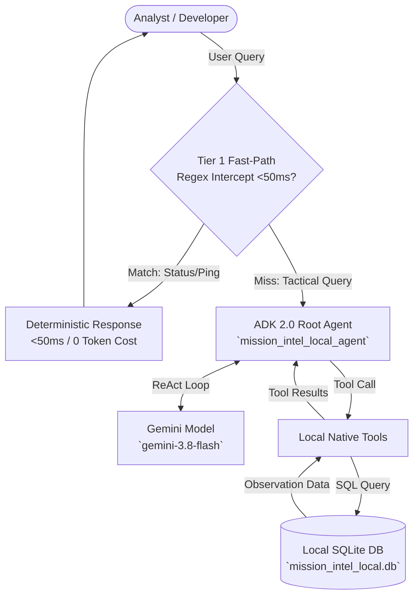

# Lab 2: Developing with the Agent Developer Kit (ADK) & Local Interface

**Target Persona:** UK Ministry of Defence (MOD) Joint Command Staff & Multi-Domain Analysts  
**Operational Context:** Local Prototyping & Autonomous ReAct Cognitive Loops  
**Architecture Reference:** [architecture.md §3.2, §3.6](../lab0/architecture.md) & [Spec.md §2.2, §4.1](../Spec.md)  
**Security Classification:** Demonstrator  

---

## 📋 Prerequisites & Prior Lab Dependencies

> [!NOTE]
> **Lab 2 develops an autonomous cognitive loop locally** using ADK 2.0 and SQLite before deploying to Vertex AI in Lab 3. It utilizes the multi-domain schema established in Lab 1.

| Prerequisite Dimension | Specification / Requirement |
| :--- | :--- |
| **Required Prior Labs** | **Lab 1** (Schema familiarity & table relationships) |
| **Local Environment** | Python 3.11+ with Google ADK installed (`pip install google-adk`) |
| **Foundation Model** | Gemini 3.8 Flash (`gemini-3.8-flash`) |
| **Required Artifacts** | Local SQLite database `lab2/mission_intel_local.db` (seeded automatically or via `python3 lab2/code/setup_local_db.py`) |
| **Fast-Forward Command** | `cd lab2/code && python3 setup_local_db.py && python3 agent.py "Find EW bearings for TRK-901"` |

---

## Objective & Architectural Rationale
Learn how to build, test, and debug an agentic AI application locally using the **Google Agent Developer Kit (ADK 2.0)** and the interactive **ADK Web Interface**.

Before deploying agents to production cloud infrastructure or secure enclaves, AI developers use the **ADK Local Developer Workflow** to:
1. **Model the ReAct Cognitive Loop**: Inspect the autonomous *Thought $\rightarrow$ Action $\rightarrow$ Observation $\rightarrow$ Synthesis* chain in real time.
2. **Implement Schema Self-Correction**: Verify the agent's ability to recover from database syntax and schema errors without crashing the session (`Spec.md §2.2, BAC-02`).
3. **Validate Tier 1 Fast-Path Intercepts**: Implement deterministic pattern matching to bypass LLM inference for routine status queries, resolving in $< 50\text{ ms}$ with zero token cost (`Spec.md §4.1, BAC-03`).
4. **Inspect Tool Execution Timelines**: Audit tool invocation arguments, payload byte sizes, and intermediate observations before cloud deployment.

---

## 🏛️ Architecture & Component Mapping



---

## 🏛️ Google Best Practice: ADK 2.0 Engineering & Scaling Science

When developing cognitive agents with ADK 2.0, Google Recommended Best Practices define four foundational architectural principles:

### 1. The Core ADK 2.0 Runtime Abstractions
ADK 2.0 shifts from prompt-only orchestration to a deterministic execution runtime powered by primary abstractions:
1. **`Agent`**: The central persona entity defining instructions and capabilities.
2. **`Gemini` Foundation Model**: The orchestrator engine (e.g. `gemini-3.8-flash`) that powers the ReAct cognitive loop.
3. **`InMemoryRunner`**: The local execution environment that manages the conversational loops and tool execution.
4. **Native Python `@tool` Decorators**: Allows binding of local Python functions (e.g., SQLite DB calls) directly to the agent's capabilities.
* **📚 Further Reading:** [Google Agent Developer Kit (ADK 2.0) Core Concepts](https://adk.dev/2.0/concepts/runtime)

### 2. Context Engineering & The Constrained RAM Model ($C = P + M$)
* **The Architecture**: Treat the LLM context window as constrained RAM ($C = P + M$), where $P$ is prompt-visible working memory and $M$ is external environment/storage. Even with 1M+ token windows, dumping excessive raw telemetry causes:
  - **Context Collapse**: Summarization silently drops critical tactical constraints or coordinate data.
  - **Observation Flooding**: Verbose raw database payloads drown out mission rules ("lost in the middle").
* **Mitigation via Progressive Disclosure**:
  - **Level 1 (Metadata ~60 tokens)**: Discover tool and skill names/descriptions at startup.
  - **Level 2 (Instructions)**: Load operational procedures only when matched to current intent.
  - **Level 3 (Resources)**: Fetch specific schema definitions and reference assets on-demand.
* **📚 Further Reading:** [Vertex AI: Prompt Design Strategies & Context Engineering](https://cloud.google.com/vertex-ai/generative-ai/docs/learn/prompt-design-strategies)

### 3. Tool Engineering & Self-Repair Mechanics
* **"An LLM without tools is a brilliant intern with no logins."**
* **Strict Python Typing**: ADK automatically generates the JSON Schema tool definition directly from Python type hints (`param: str, limit: int`). Omitting type hints leads to tool call hallucination.
* **Docstrings as Tool Selection Prompts**: The docstring is the primary prompt guiding the model *when* and *why* to select the tool.
* **Return Structured Error Dicts (Never Throw Unhandled Exceptions)**:
  - When a query fails (e.g., column does not exist), catching the exception and returning a structured dictionary (`{"status": "error", "message": "no such column 'missile_payload' in radar_telemetry; available columns: [track_id, platform_type, signature...]"}`) allows the ReAct cognitive loop to read the error and autonomously self-correct (as demonstrated in **Test 2**).
* **📚 Further Reading:** [Vertex AI: Function Calling & Tool Execution](https://cloud.google.com/vertex-ai/generative-ai/docs/multimodal/function-calling)

### 4. Multi-Agent Scaling Science (Google Research 2026)
Empirical findings across 180 multi-agent system configurations reveal critical rules for agent decomposition:
* **The Alignment Principle (+81% performance gain)**: Tasks that decompose into independent, parallelizable sub-problems achieve massive speed and accuracy gains under a centralized coordinator.
* **The Sequential Penalty (-39% to -70% degradation)**: Splitting tightly coupled sequential reasoning across multiple agents degrades accuracy because inter-agent handoffs fragment implicit reasoning context. Keep sequential reasoning in a single agent or deterministic pipeline.
* **The Tool-Use Bottleneck (>16 tools)**: Coordination overhead scales super-linearly with tool count. Curate toolsets ruthlessly: 4 well-documented tools consistently outperform 16 overlapping ones.
* **Error Amplification Mitigation**: Independent multi-agent chains amplify hallucinations by **17.2x**. Introducing a **Centralized Orchestrator** acts as a verification bottleneck, containing error amplification to **4.4x**.
* **📚 Further Reading:** [Vertex AI Reasoning Engine: Multi-Agent Architectures](https://cloud.google.com/vertex-ai/generative-ai/docs/reasoning-engine/overview)

---

## 🛠️ Step-by-Step Instructions

### Step 1: Populate Local Mission Intelligence Database
Run `setup_local_db.py` to initialize a local SQLite database containing the 6 multi-domain defense mission tables (`radar_telemetry`, `ew_intercepts`, `satellite_recon`, `cyber_threat_intel`, `humint_reports`, `friendly_assets`):
```bash
cd lab2
python3 setup_local_db.py
```

### Step 2: Review Agent Code (`agent.py`)
Inspect `agent.py` in your editor. Notice how:
1. **Native Python Tools**: `query_local_intelligence` and `list_local_tables` are registered directly in `tools=[query_local_intelligence, list_local_tables]`.
2. **Environment Dynamic**: Model configurations dynamically read `PROJECT_ID` and `LOCATION` from environment variables without hardcoded values.
3. **Fast-Path Intercept**: Deterministic status queries bypass the model loop.
4. **System Instructions**: Define the persona as a UK MOD Joint Command Staff Intelligence Agent operating under NATO-first doctrine.

### Step 3: Launch the ADK Web Interface
Launch the local **ADK Web Interface** to test and debug your agent interactively in your browser:
```bash
adk web ./
```
> **Accessing the Web Interface**: Open [https://adk.dev/runtime/web-interface/](https://adk.dev/runtime/web-interface/) or `http://localhost:8000` in your browser. Select `mission_intel_local_agent` from the dropdown to start asking multi-domain questions, viewing tool execution timelines, and inspecting raw event payloads.

### Step 4: CLI Testing Option (Terminal Execution)
You can also run the agent directly in your terminal for rapid command-line testing:
```bash
python3 agent.py "Find the EW bearings and emitter details associated with radar track TRK-901 in mission_intel_local.db."
```

---

## 🔍 Interactive Customer Test Suite & Architectural Verification

Execute these three interactive test prompts to verify key architectural learning points:

### Test 1: ReAct Reasoning Loop & Multi-Hop Tool Invocation
* **Input Prompt:**
  > *"What is the threat designation of radar track TRK-901, and does our local intelligence database record any electronic warfare emitters matching it?"*
* **Proven Learning Point:** Observing the autonomous ReAct *Thought $\rightarrow$ Action (`query_local_intelligence`) $\rightarrow$ Observation $\rightarrow$ Synthesis* loop in real time.
* **Expected Outcome:** Agent decomposes query into two SQL calls, extracts `target_id: TGT-ALPHA-7`, queries `ew_intercepts`, and returns a synthesized report identifying the Karakurt-class corvette and Mineral-ME radar at 9.41 GHz.

---

### Test 2: Autonomous Schema Error Self-Correction
* **Input Prompt:**
  > *"What is the missile payload capacity for friendly asset HMS Defender in the radar_telemetry table?"*
* **Proven Learning Point:** Autonomous error reflection and self-correction upon encountering database schema exceptions (`Spec.md §2.2, BAC-02`).
* **Expected Outcome:** Initial query fails (`no such column/table in radar_telemetry`); agent intercepts exception, analyzes schema metadata, pivots query to `friendly_assets`, and accurately returns the Aster-30 Sea Viper missile payload.

---

### Test 3: Tier 1 Sub-50ms Fast-Path Optimization
* **Input Prompt:**
  > *"Hello agent, what is your operational status and system capability?"*
* **Proven Learning Point:** Fast-path deterministic intercept bypassing LLM inference, reducing token cost to zero and latency to $< 50\text{ ms}$ (`Spec.md §4.1, BAC-03`).
* **Expected Outcome:** Agent responds in $< 50\text{ ms}$ with zero token cost, displaying pre-compiled mission readiness status.

---

## 📜 Agent Reference Implementation (`agent.py`)

```python
import os
import sys
import re
import sqlite3
import asyncio
from typing import Dict, Any, List
from google.adk.agents import Agent
from google.adk.models.google_llm import Gemini
from google.adk.runners import InMemoryRunner
import google.genai.types as types

PROJECT_ID = os.environ.get("PROJECT_ID", "default-project")
LOCATION = os.environ.get("LOCATION", "us-central1")
DB_PATH = os.path.join(os.path.dirname(__file__), "mission_intel_local.db")

# Tier 1 Fast-Path Intercept Engine (<50ms, 0 Tokens)
FAST_PATH_PATTERNS = [
    (r"^\s*(ping|health|status|heartbeat)\s*$", 
     "SYSTEM READY: Mission Intelligence Agent online. ReAct engine primed. Local database connected."),
    (r"^\s*(hello|hi|greetings|help)\s*$", 
     "OPERATIONAL: UK MOD Joint Command Intelligence Assistant ready. Multi-domain telemetry accessible.")
]

def check_fast_path(prompt: str) -> str:
    for pattern, response in FAST_PATH_PATTERNS:
        if re.search(pattern, prompt, re.IGNORECASE):
            return response
    return None

# Native Python Tools for Local SQLite Mission Data
def query_local_intelligence(sql_query: str) -> List[Dict[str, Any]]:
    """Executes a SELECT SQL query against local SQLite mission_intel_local.db."""
    if not os.path.exists(DB_PATH):
        from setup_local_db import init_db
        init_db()
        
    conn = sqlite3.connect(DB_PATH)
    conn.row_factory = sqlite3.Row
    cursor = conn.cursor()
    try:
        cursor.execute(sql_query)
        rows = cursor.fetchall()
        result = [dict(row) for row in rows]
        conn.close()
        return result
    except Exception as e:
        conn.close()
        return [{"error": str(e)}]

def list_local_tables() -> List[str]:
    """Lists all table names available in the local mission intelligence database."""
    if not os.path.exists(DB_PATH):
        from setup_local_db import init_db
        init_db()
    conn = sqlite3.connect(DB_PATH)
    cursor = conn.cursor()
    cursor.execute("SELECT name FROM sqlite_master WHERE type='table';")
    tables = [row[0] for row in cursor.fetchall()]
    conn.close()
    return tables

# Configure Gemini LLM (Enterprise mode, global endpoint)
gemini_model = Gemini(
    model="gemini-3.8-flash",
    client_kwargs={
        "enterprise": True,
        "project": PROJECT_ID,
        "location": "global"
    }
)

# Root Agent Configuration
root_agent = Agent(
    model=gemini_model,
    name="mission_intel_local_agent",
    instruction=(
        "You are a UK MOD Joint Command Staff Intelligence Agent.\n"
        "You correlate multi-domain telemetry across radar, electronic warfare, cyber, and allied assets.\n"
        "Security Classification: Demonstrator.\n"
        "If a SQL query fails due to schema errors, inspect available tables using list_local_tables and self-correct."
    ),
    tools=[query_local_intelligence, list_local_tables]
)

async def main():
    prompt = " ".join(sys.argv[1:]) if len(sys.argv) > 1 else "Find EW bearings associated with TRK-901."
    
    # Check fast path first
    fast_response = check_fast_path(prompt)
    if fast_response:
        print(f"[FAST-PATH <50ms] {fast_response}")
        return

    runner = InMemoryRunner(agent=root_agent, app_name="mission_intel_local_app")
    session = await runner.session_service.create_session(app_name="mission_intel_local_app", user_id="dev_user")
    content = types.Content(role="user", parts=[types.Part.from_text(text=prompt)])
    
    async for event in runner.run_async(user_id="dev_user", session_id=session.id, new_message=content):
        if event.content and event.content.parts:
            for part in event.content.parts:
                if part.text:
                    print(part.text, end="", flush=True)

if __name__ == "__main__":
    asyncio.run(main())
```

---

## 🎓 Key Learning Points (Master Study Guide Alignment)

This lab incorporates core foundational agent design principles from the **Master Study Guide**:

### 1. The ReAct Cognitive Loop Mechanics
* **Execution Flow:** The agent operates via the ReAct (Reasoning + Acting) pattern:
  $$\text{User Query} \longrightarrow \text{LLM Reasoning (Thought)} \longrightarrow \text{Structured FunctionCall} \longrightarrow \text{Python Runtime Tool Dispatch} \longrightarrow \text{FunctionResponse (Observation)} \longrightarrow \text{Final Synthesis}$$
* **Gemini 3.8 Flash Engine:** Leverages `gemini-3.8-flash` in enterprise mode. Flash provides high-frequency multi-turn reasoning and tool invocation at a fraction of the latency and token cost of frontier reasoning models.

### 2. Database Schema Error Self-Correction
* **The Failure Mode:** When an agent queries a database with an invalid column name, hallucinated table name, or syntax error, naive implementations crash or apologize helplessly to the user.
* **The Self-Correction Loop:** In ADK 2.0, database errors return structured error dictionaries directly into the conversation history. The Gemini model observes the error, inspects schema metadata, generates a corrected SQL query, and succeeds—all within the same user turn without human intervention.

### 3. Tier 1 Fast-Path Intercept Routing (Semantic Caching)
* **Token Economics & Latency:** Routine queries like `ping`, `status`, `health`, and operational greetings do not require multi-billion parameter neural network inference.
* **Deterministic Intercept:** By inserting a fast-path interceptor ahead of the ADK runner, basic operational checks resolve in **$< 50\text{ ms}$** with **zero LLM token consumption**, saving API budget and protecting reasoning quotas.

### 4. Local Prototyping Before Cloud Deployment
* **Hermetic Feedback Loops:** Testing with local SQLite and `InMemoryRunner` enables developers to verify tool parameters, exception handling, and prompt instructions within 1-2 seconds per cycle, completely decoupled from cloud IAM latency, container builds, and deployment pipelines.

---


## 🚀 System Architecture Improvement Opportunities

While local ADK 2.0 execution is excellent for rapid prototyping, scaling developer operations and agent complexity requires more robust architectural patterns:

*   **Google Cloud Architecture Framework (Operational Excellence): Cloud Workstations**
    *   *Improvement:* Instead of relying on local laptops (which risk data exfiltration and environment drift), transition the ADK development environment to Google Cloud Workstations. This provides managed, secure, and standardized IDE environments running within the VPC boundary, ensuring that tactical code and local SQLite data never touch physical endpoints.
    *   *Reference:* [Cloud Workstations Architecture](https://cloud.google.com/workstations/docs/concepts)
*   **Google ADK 2.0: Sub-Agent Routing & Swarms**
    *   *Improvement:* The current implementation uses a single, monolithic ReAct agent loop. For complex operations, leverage ADK 2.0's multi-agent orchestration to deploy specialized sub-agents (e.g., a dedicated `RadarAgent` and a `CyberAgent`) managed by a central Router, isolating tool contexts and reducing token overhead per turn.
    *   *Reference:* [Google ADK 2.0 Documentation](https://adk.dev/2.0/)
*   **Broader Google Cloud Capability: Cloud Spanner / AlloyDB for Persistent State**
    *   *Improvement:* The local sandbox uses SQLite, which does not scale for persistent memory. Migrate the conversational state and long-term memory graph to Cloud Spanner or AlloyDB. This provides global consistency and high availability for multi-turn operational sessions that need to survive container restarts.
    *   *Reference:* [Cloud Spanner Documentation](https://cloud.google.com/spanner/docs)
