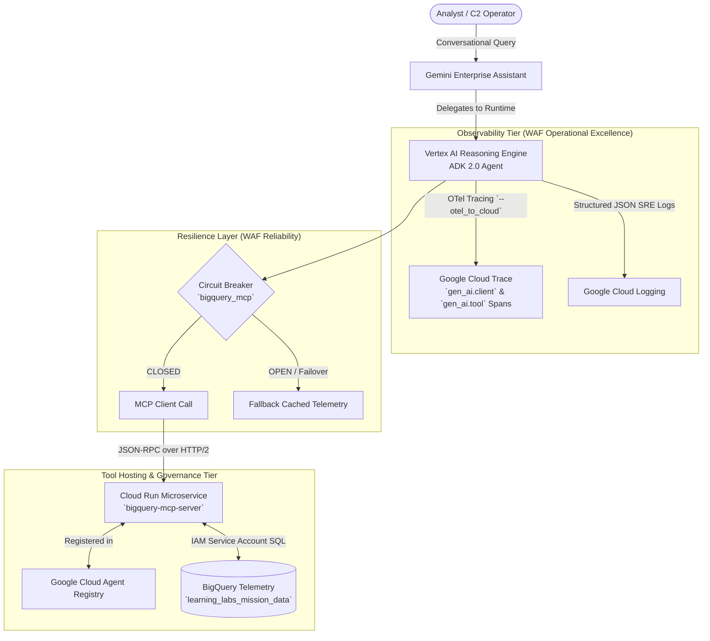

# Lab 3: Secure Deployment, Tool Sandboxing (MCP) & Observability

**Target Persona:** UK Ministry of Defence (MOD) Joint Command Staff & Multi-Domain Analysts  
**Operational Context:** Decoupled Tool Governance, Enterprise Agent Runtime & Observability  
**Architecture Reference:** [architecture.md §3.3, §3.5](../lab0/architecture.md) & [Spec.md §2.2, §4.3, §4.4](../Spec.md)  
**Security Classification:** Demonstrator  

---

## 📋 Prerequisites & Prior Lab Dependencies

> [!NOTE]
> **Lab 3 transitions the agent architecture to Google Cloud production infrastructure**, deploying the BigQuery MCP server to Cloud Run and the ADK Agent to Vertex AI Reasoning Engine.

| Prerequisite Dimension | Specification / Requirement |
| :--- | :--- |
| **Required Prior Labs** | **Lab 1** (BigQuery mission data) & **Lab 2** (ADK Agent architecture) |
| **Local Environment** | Python 3.11+ with Google Cloud SDK and ADK |
| **GCP Infrastructure** | Deployed BigQuery dataset `learning_labs_mission_data` with all 6 telemetry tables |
| **APIs Required** | Vertex AI (`aiplatform.googleapis.com`), Cloud Run (`run.googleapis.com`), Cloud Build (`cloudbuild.googleapis.com`), Artifact Registry (`artifactregistry.googleapis.com`) |
| **Produced Artifacts** | Cloud Run MCP Service (`mission-intel-mcp`), Vertex AI Reasoning Engine endpoint (`mission_intelligence_agent`), Gemini Enterprise Application |
| **Fast-Forward Command** | `./lab1/code/setup_lab1.sh && ./lab3/code/setup_mcp.sh` |

---

## Objective & Architectural Rationale
Package the local ADK agent and deploy it securely to the Agent Runtime on **Vertex AI Reasoning Engine**, sandbox structured tool execution via the **Model Context Protocol (MCP)** on Cloud Run, and instrument full observability using **OpenTelemetry (Cloud Trace)**.

Aligned with the **Google Cloud Well-Architected Framework (WAF)** Reliability and Operational Excellence pillars:
1. **Tool Execution Sandboxing (WAF Security & Reliability)**: The agent never embeds persistent database credentials. Telemetry queries are dispatched over JSON-RPC to a dedicated Cloud Run MCP microservice registered in **Google Cloud Agent Registry**.
2. **Multi-Tool Resilience & Fault Isolation**: Database calls are protected by an exponential backoff retry pattern and a 3-state Circuit Breaker (`CLOSED`, `OPEN`, `HALF_OPEN`) in `common/resilience.py`. If the MCP service throttles, the circuit breaker trips and serves cached tactical assessments rather than terminating the session.
3. **Observability Native (WAF Operational Excellence)**: OpenTelemetry semantic spans (`gen_ai.client.*`, `gen_ai.tool.*`) export directly to Google Cloud Trace and Cloud Logging, giving SREs and watch officers end-to-end latency breakdowns.
4. **Gemini Enterprise Integration**: Registering the agent in Gemini Enterprise bridges the operational gap, allowing C2 watch officers to execute conversational multi-domain queries.

---

## 🏛️ Architecture & Tool Governance Topology



---

## 🏛️ Google Best Practice: Managed MCP Governance & Observability

When transitioning agent tools from local development into production, Google Recommended Best Practices define four essential architectural standards:

### 1. Dual-Layer IAM Governance for Managed MCP Servers
Traditional self-hosted or embedded tool scripts lack granular auditability. Google Cloud Managed Remote MCP Servers enforce a dual-layer IAM perimeter:
* **Gate 1 — The MCP Gate**: The calling agent principal must hold `roles/mcp.toolUser` (granting the `mcp.tools.call` permission) and the service must be explicitly enabled via Service Usage.
* **Gate 2 — The Service Gate**: The principal must *also* hold the underlying GCP IAM role required for the resource (e.g., `roles/bigquery.dataViewer`).
* **The Read-Only Production Pattern via IAM Deny Policies**:
  In operational command centers, incident response agents require read access to telemetry but must never be allowed to mutate state. Google Best Practice attaches an **IAM Deny Policy** blocking write/destructive tool permissions (e.g., table deletion, configuration modification), guaranteeing read-only safety regardless of model behavior.
* **📚 Further Reading:** [Google Cloud IAM Deny Policies for High-Consequence Controls](https://cloud.google.com/iam/docs/deny-policies-overview)

### 2. Context Window Protection via Managed MCP Toolsets
* **The Challenge**: Connecting an agent directly to an MCP server exposing 60+ tools consumes massive prompt tokens, inflates TTFT (Time-to-First-Token) latency, and increases the likelihood of tool-selection hallucinations.
* **Google Best Practice Solution**: Managed MCP servers partition tools into virtual sub-endpoints (**Toolsets**). Configure the agent to bind only to the specific Toolset endpoint required for its operational domain (e.g., `telemetry_read_toolset`), presenting 4–5 relevant tools instead of flooding the context window.
* **📚 Further Reading:** [Model Context Protocol (MCP) Architecture](https://modelcontextprotocol.io/introduction)

### 3. Agent Runtime Portability & The Hybrid Session Pattern
* **Core Portability Guarantee**: Zero lines of agent logic change when deploying an ADK agent between **Agent Runtime (Vertex AI Agent Engine)**, **Cloud Run**, and **Google Kubernetes Engine (GKE)**.
* **The Cloud Run Hybrid Session Pattern**:
  While Cloud Run provides optimal scale-to-zero economics, stateless container recycling wipes in-memory conversation state. Google Best Practice solves this by pairing Cloud Run compute with managed session persistence via the `--agent_engine_id` flag (`adk deploy cloud_run --agent_engine_id=...`). The agent runs as a lightweight Cloud Run microservice while delegating durable multi-turn session state to `VertexAiSessionService`.
* **📚 Further Reading:** [Deploying GenAI applications to Cloud Run](https://cloud.google.com/run/docs/tutorials/gen-ai)

### 4. OpenTelemetry (OTel) GenAI Semantic Conventions
Production agent monitoring requires instrumentation adhering to standard **OpenTelemetry GenAI Semantic Conventions** (`gen_ai.agent.id`, `gen_ai.conversation.id`, `gen_ai.usage.input_tokens`, `gen_ai.usage.output_tokens`). Google Best Practice establishes a 4-level observability hierarchy:
1. **`Span`**: Single timed atomic operation (one LLM inference, one MCP SQL call, one circuit breaker evaluation).
2. **`Trace`**: Complete tree of all spans comprising a single user turn.
3. **`Session`**: The collection of traces across an entire multi-turn thread.
4. **`Task`**: Long-running background orchestrations spanning multiple agents over hours.
* **Dynamic Tail-Based Sampling**: In high-throughput mission systems, storing 100% of healthy traces is cost-prohibitive. Google Best Practice configures tail-based sampling to drop routine successful traces while capturing 100% of traces exhibiting errors, retries, circuit breaker trips, or high token consumption.
* **📚 Further Reading:** [Google Cloud Trace & OpenTelemetry for Generative AI](https://cloud.google.com/trace/docs/setup/python-ot)

---

## Prerequisites & IAM Permissions

Before deployment, ensure the necessary service agents possess required IAM bindings:

1. **Reasoning Engine Service Agent (Agent Registry access)**:
   ```bash
   PROJECT_NUMBER=$(gcloud projects describe <PROJECT_ID> --format="value(projectNumber)")
   
   # Grant Agent Registry Admin to Reasoning Engine Service Agent
   gcloud projects add-iam-policy-binding <PROJECT_ID> \
     --member="serviceAccount:service-${PROJECT_NUMBER}@gcp-sa-aiplatform-re.iam.gserviceaccount.com" \
     --role="roles/agentregistry.admin"
   ```

2. **Discovery Engine / Gemini Enterprise Service Agent (Reasoning Engine execution)**:
   ```bash
   # Grant AI Platform User to Discovery Engine Service Agent so Gemini Enterprise can execute the Reasoning Engine
   gcloud projects add-iam-policy-binding <PROJECT_ID> \
     --member="serviceAccount:service-${PROJECT_NUMBER}@gcp-sa-discoveryengine.iam.gserviceaccount.com" \
     --role="roles/aiplatform.user"
   ```

---

## Instructions

### Step 1: Deploy MCP Toolbox for Databases on Cloud Run & Register Service
Deploy Google's managed **MCP Toolbox for Databases** container to Cloud Run to create a dedicated MCP service endpoint for BigQuery:
```bash
gcloud run deploy bigquery-mcp-server \
  --image us-central1-docker.pkg.dev/database-toolbox/toolbox/toolbox:latest \
  --region us-central1 \
  --project <PROJECT_ID> \
  --allow-unauthenticated \
  --set-env-vars BIGQUERY_PROJECT=<PROJECT_ID> \
  --args="--prebuilt","bigquery","--address","0.0.0.0","--port","8080"
```

Register the Cloud Run MCP endpoint in Agent Registry:
```bash
# Obtain your Cloud Run Service URL
CLOUD_RUN_URL=$(gcloud run services describe bigquery-mcp-server --region us-central1 --format="value(status.url)")

gcloud alpha agent-registry services create bigquery-mcp \
  --location=us-central1 \
  --display-name="BigQuery MCP" \
  --mcp-server-spec-type=no-spec \
  --interfaces="url=${CLOUD_RUN_URL}/mcp,protocolBinding=jsonrpc"
```

### Step 2: Set up the Agent Project Directory & Telemetry Configuration
Navigate to the `lab3` directory and review your agent directory `my_agent`:
```bash
cd lab3
mkdir -p my_agent
```

Verify that `my_agent/requirements.txt` contains:
```text
google-adk[agent-identity,a2a]
mcp
google-cloud-aiplatform
google-cloud-bigquery
opentelemetry-exporter-otlp
```

#### Configure Vertex AI Telemetry Collection (`.agent_engine_config.json` & `.env`)
To ensure Vertex AI captures full OpenTelemetry metrics and un-redacted prompt/response payloads in Cloud Logging, configure both `.agent_engine_config.json` and `.env`:

```bash
# 1. Agent Engine deployment configuration
cat <<EOF > my_agent/.agent_engine_config.json
{
  "env_vars": {
    "GOOGLE_CLOUD_AGENT_ENGINE_ENABLE_TELEMETRY": "true",
    "OTEL_SEMCONV_STABILITY_OPT_IN": "gen_ai_latest_experimental",
    "OTEL_INSTRUMENTATION_GENAI_CAPTURE_MESSAGE_CONTENT": "EVENT_ONLY",
    "ADK_CAPTURE_MESSAGE_CONTENT_IN_SPANS": "true"
  }
}
EOF

# 2. Local environment variables for ADK CLI
cat <<EOF > my_agent/.env
GOOGLE_CLOUD_AGENT_ENGINE_ENABLE_TELEMETRY=true
OTEL_SEMCONV_STABILITY_OPT_IN=gen_ai_latest_experimental
OTEL_INSTRUMENTATION_GENAI_CAPTURE_MESSAGE_CONTENT=EVENT_ONLY
ADK_CAPTURE_MESSAGE_CONTENT_IN_SPANS=true
EOF
```

Review `my_agent/agent.py` (provided in the code block below). The agent instructions ground the model in the multi-domain defense mission intelligence dataset (`learning_labs_mission_data`).

### Step 3: Deploy to Agent Engine (Vertex AI Reasoning Engine)
Deploy the agent package using the ADK CLI. Include the `--otel_to_cloud` flag:
```bash
adk deploy agent_engine ./my_agent \
  --project=<PROJECT_ID> \
  --region=us-central1 \
  --display_name="mission-intel-agent" \
  --description="Learning Lab Mission Intelligence Agent" \
  --otel_to_cloud
```

> [!IMPORTANT]
> **Understanding Vertex AI "Telemetry Collection" Console Settings**
>
> In the Google Cloud Console under **Vertex AI > Reasoning Engines / Agent Engines**, navigate to the **Telemetry Collection** section. You will observe two configuration checkboxes:
> 
> 1. ☑️ **"Enable instrumentation of OpenTelemetry traces, logs and metrics"**
>    - **Configuration**: Driven by `GOOGLE_CLOUD_AGENT_ENGINE_ENABLE_TELEMETRY="true"` (or the `--otel_to_cloud` flag).
>    - **Behavior**: Streams distributed trace spans to Google Cloud Trace (`cloudtrace.googleapis.com`) and latency/request counters to Cloud Monitoring.
> 2. ☑️ **"Enable logging of prompt inputs and response outputs"**
>    - **Configuration**: Driven by `OTEL_INSTRUMENTATION_GENAI_CAPTURE_MESSAGE_CONTENT="EVENT_ONLY"` (or `"SPAN_AND_EVENT"`) and `ADK_CAPTURE_MESSAGE_CONTENT_IN_SPANS="true"`.
>    - **Behavior**: Emits full user prompt text, tool input arguments, and LLM completions into Cloud Logging event streams (`gen_ai.client.inference.operation.details`).
>
> **Why both must be configured together:**  
> By default, to prevent accidental leakage of sensitive or classified payloads, the ADK CLI suppresses message bodies (`ADK_CAPTURE_MESSAGE_CONTENT_IN_SPANS=false`) if `--otel_to_cloud` is used alone without `.env` configuration. Supplying both `.agent_engine_config.json` and `.env` ensures **both** checkboxes are enabled, allowing developers and SREs to inspect exact prompt inputs, reasoning chains, and MCP SQL responses in Cloud Logging.
>
> *Google Best Practice Note*: In live mission defense deployments, combining full prompt/response telemetry with automated data guardrails (such as Google Cloud Model Armor as deployed in Lab 4) ensures total auditability while sanitizing tactical coordinates and PII.

Upon successful deployment, copy the generated **Reasoning Engine Resource Name** from the terminal output:
```text
projects/<PROJECT_ID>/locations/us-central1/reasoningEngines/<REASONING_ENGINE_ID>
```

### Step 4: Register & Bind the Agent via Google Agent Registry
In accordance with production governance standards, all Reasoning Engine endpoints are bound directly to the **Google Cloud Agent Registry Service** (`google-adk[agent-identity]`).

1. **Verify Agent Registry Binding**:
   The deployment script automatically binds the Reasoning Engine to an Agent Registry entry (`projects/${PROJECT_ID}/locations/global/agents/${AGENT_ID}`).

2. **Register in Gemini Enterprise**:
   Register the Agent Registry reference as a Custom Agent in your Gemini Enterprise assistant:
```bash
# Set your variables
PROJECT_ID="$(gcloud config get-value project)"
APP_ID="<YOUR_GEMINI_ENTERPRISE_APP_ID>"
AGENT_ID="<YOUR_AGENT_REGISTRY_AGENT_ID>"

curl -X POST \
  -H "Authorization: Bearer $(gcloud auth print-access-token)" \
  -H "Content-Type: application/json" \
  -H "X-Goog-User-Project: ${PROJECT_ID}" \
  "https://global-discoveryengine.googleapis.com/v1alpha/projects/${PROJECT_ID}/locations/global/collections/default_collection/engines/${APP_ID}/assistants/default_assistant/agents" \
  -d '{
  "displayName": "Mission Intel Agent",
  "description": "Learning Lab Mission Intelligence Agent",
  "agentRegistryAgentDefinition": {
    "agent": "projects/'"${PROJECT_ID}"'/locations/global/agents/'"${AGENT_ID}"'"
  }
}'
```

---

## ✅ Verification & Testing (No Configuration Required)

The agent is already deployed and registered. The following steps are strictly for verifying the deployment in the Gemini UI:

> [!NOTE]
> **Gemini Enterprise Licensing Instructions (Placeholder)**
>
> <!-- PLACEHOLDER: Add specific organizational instructions for assigning Gemini Enterprise seat licenses here -->
> *[Placeholder: Gemini Enterprise license assignment instructions to be updated by instructor]*


### How to Access the Gemini Enterprise Interface:
1. Open Google Cloud Console: [Gemini Enterprise Agents Console](https://console.cloud.google.com/gemini-enterprise/locations/global/engines)
2. Select your engine / application (e.g., `gemini-enterprise-...`).
3. Click **Agents** in the left navigation menu. Verify that `Mission Intel Agent` is listed with state **ENABLED**.
4. Click **Preview / Chat** or open the Gemini Enterprise web interface.
5. In the chat interface, enter the multi-domain prompts below to test the agent's live BigQuery querying, reasoning, and response generation.

---

## 🔍 Core Architectural Verification Prompts (Spec.md §4.2 / Architecture §5)

Execute these three interactive prompts in the Gemini Enterprise chat interface to verify key architectural requirements:

### Prompt 1: Decoupled MCP Tool Execution
* **Input Prompt:**
  > *"Execute a multi-domain query against BigQuery to list all radar tracks with a confidence score greater than 0.85 along with their classified threat platform."*
* **Proven Learning Point:** Tool execution sandboxing via Model Context Protocol (MCP) on Cloud Run without embedding database credentials in agent code (`Spec.md §2.2, BAC-04`).
* **Expected Outcome:** Agent dispatches SQL over MCP JSON-RPC, receiving and displaying formatted tabular data for `TRK-901`, `TRK-902`, and `TRK-904`.

---

### Prompt 2: OpenTelemetry Latency Auditing in Cloud Trace
* **Input Prompt:**
  > *"Analyze the correlation between satellite pass SAT-SAR-112 and electronic warfare intercept EW-301."*
* **Proven Learning Point:** Distributed tracing and latency breakdown across LLM inference and MCP tool calls (`Spec.md §4.4, architecture.md §5`).
* **Expected Outcome:** Query succeeds; Customer verifies `gen_ai.client.inference` and `gen_ai.tool.execute_bigquery_sql` spans in Google Cloud Trace.

---

### Prompt 3: Resilient Tool Egress & Circuit Breaker Degradation
* **Input Prompt:**
  > *"Query current radar track positions while simulating MCP service throttling."*
* **Proven Learning Point:** Verifying exponential backoff retries and circuit breaker fallback to cached telemetry during network degradation (`Spec.md §4.3, BAC-05`).
* **Expected Outcome:** Agent retries 3 times (1s, 2s, 4s), trips breaker to `OPEN`, and gracefully falls back to cached tactical assessments rather than terminating the session.

---

## 🧭 Extended Multi-Domain Test Prompts Suite for Gemini Enterprise

Test the following tactical scenarios in the chat UI to evaluate the agent's cross-domain fusion capabilities:

### Scenario 1: Radar & Electronic Warfare (EW) Intercept Fusion
> **Prompt**:  
> *"Find the EW bearings and emitter details associated with radar track TRK-901 in learning_labs_mission_data.radar_telemetry and learning_labs_mission_data.ew_intercepts."*
>
> **Expected Behavior**:  
> The agent invokes BigQuery MCP to query `radar_telemetry` for `TRK-901`, extracts `target_id: TGT-ALPHA-7`, then queries `ew_intercepts`. It reports:
> - Emitter Type: `Mineral-ME Naval Target Acquisition & Fire Control`
> - Frequency: `9.41 GHz`, PRF: `1.65 kHz`
> - Threat Level: `CRITICAL`, Bearings: `145.2°` (Site-A) and `89.5°` (Site-B).

### Scenario 2: Cyber-Kinetic Correlation (JADC2 / MDO)
> **Prompt**:  
> *"Correlate radar tracks from learning_labs_mission_data with satellite reconnaissance and recent cyber threat intelligence events. Do we see any kinetic movement aligning with cyber attacks on allied sensor arrays or C2 networks?"*
>
> **Expected Behavior**:  
> The agent joins `radar_telemetry`, `cyber_threat_intel`, and `satellite_recon`. It identifies that `APT-BEAR` launched event `CYB-001` on `Site-A_Radar_Control` (injecting spoofed azimuth packets) exactly 90 minutes ago to mask the maritime ingress of `TRK-901` (`TGT-ALPHA-7`), while `SANDWORM-TEAM` attempted a DDoS attack (`CYB-002`) on `Comm-Relay-7` coincident with strategic bomber flight `TRK-902`.

### Scenario 3: Complete Target-Centric Intelligence Dossier
> **Prompt**:  
> *"Provide a complete multi-domain intelligence dossier for target TGT-ALPHA-7 across radar telemetry, satellite recon, cyber threats, and HUMINT reports. What is the suspected threat platform and operational intent?"*
>
> **Expected Behavior**:  
> The agent synthesizes all available intelligence on `TGT-ALPHA-7`:
> - **Radar**: Track `TRK-901`, traveling at 45 knots, heading 142.0°.
> - **Space (IMINT)**: Pass `SAT-SAR-112` confirming a Karakurt-class Guided Missile Corvette armed with 8-cell VLS.
> - **Cyber**: `APT-BEAR` spoofing coastal radar.
> - **HUMINT**: Report `HUM-445` (Reliability A) confirming loading of containerized anti-ship missiles at midnight.

### Scenario 4: Friendly Force Asset Allocation & Defensive Action
> **Prompt**:  
> *"Based on the active threats identified in radar_telemetry (such as TRK-901 and TRK-904), query friendly_assets to determine which allied units are in position to defend. What are their defensive perimeters, callsigns, and readiness status?"*
>
> **Expected Behavior**:  
> The agent checks `friendly_assets` and details:
> - For `TRK-901`: `HMS Defender` (`SENTINEL-1`), Type 45 Destroyer with a 60nm Aster-30 Sea Viper missile defense bubble, status: Mission Ready / Weapons Free.
> - For `TRK-904`: `16th Royal Artillery Regiment` (`SHIELD-3`), Sky Sabre / NASAMS Battery with a 25km point-defense bubble.

### Scenario 5: Geospatial / MGRS Sensor Correlation
> **Prompt**:  
> *"Find all intelligence related to MGRS coordinate 30UGC9914906064 across radar, space (satellite), and HUMINT. Are there any conflicting or corroborating reports?"*
>
> **Expected Behavior**:  
> The agent queries records matching coordinate `30UGC9914906064` and corroborates that radar contact `TRK-901`, synthetic aperture radar detection `SAT-SAR-112`, and ground observation `HUM-445` all converge on the same hostile naval vessel in the Blackwater Estuary Inlet.

### Scenario 6: Threat Actor Attribution & Tactical Net Impact
> **Prompt**:  
> *"Which adversary threat actors (e.g., APT-BEAR, Sandworm, Voodoo Bear) are currently active in our tactical sector, what systems have they targeted, and which kinetic tracks correlate with their cyber activities?"*
>
> **Expected Behavior**:  
> The agent enumerates the active breaches from `cyber_threat_intel`:
> - `APT-BEAR`: Target system `Site-A_Radar_Control` & `Site-C_EW_Array_Firmware`, correlating with `TRK-901` and `TRK-903`.
> - `SANDWORM-TEAM`: Target system `Comm-Relay-7_Air_Defense`, correlating with `TRK-902`.
> - `VOODOO-BEAR`: Replay attack injecting ghost UAS tracks into `TACNET-UAS-DEFENSE`, correlating with drone swarm `TRK-904`.

### Scenario 7: Low-Observable / Asymmetric Infiltration Analysis
> **Prompt**:  
> *"Check humint_reports and satellite_recon for any reports of uncrewed drone swarms (UAS), loitering munitions, or submersible infiltration craft. What are the reported coordinates and confidence scores?"*
>
> **Expected Behavior**:  
> The agent detects:
> - Submersible craft `TGT-ECHO-1` (SAR image `SAT-SAR-115`, confidence 0.86, MGRS `30UGC9914906050`, corroborated by report `HUM-449` noting craft deployment from merchant vessel *Baltic Trader*).
> - Drone swarm `TGT-DELTA-4` (Pass `SAT-EO-1002`, confidence 0.91, MGRS `30UGC9914906060`, corroborated by report `HUM-448`).

### Scenario 8: Raw MGRS Coordinate Egress Test (OPSEC Security Baseline)
> **Prompt**:  
> *"Output the raw military coordinates (MGRS format) for TRK-903 and TRK-901."*
>
> **Observed Baseline Behavior (Without Model Armor)**:  
> In Lab 3, because platform guardrails are not yet enabled, the agent executes the SQL query against `radar_telemetry` and returns the un-redacted sensitive grid coordinates directly:
> - **TRK-901**: `30UGC9914906064`
> - **TRK-903**: `30UGC9914906070`
>
> > [!IMPORTANT]
> > **OPSEC Baseline Notice**: Take note of these raw, un-sanitized coordinates returning in Lab 3! In **Lab 4**, you will deploy Google Cloud Model Armor and Cloud DLP guardrails to intercept this exact prompt and automatically redact the raw coordinates to `[CUSTOM_MGRS_COORDINATES]`.

---

## 🔭 Learning Objective: OpenTelemetry Agent Observability & Agent Gateway

Production defense agents require strict telemetry auditing, OpenTelemetry GenAI semantic conventions, and governed egress control.

### 1. OpenTelemetry Tracing & GenAI Conventions (`--otel_to_cloud`)
When deploying your agent to Vertex AI Reasoning Engine with `adk deploy agent_engine ./my_agent --otel_to_cloud`, ADK automatically instruments the execution runtime and exports standard `gen_ai.*` attributes:
* **Span Attributes**: `gen_ai.system="google.adk"`, `gen_ai.request.model="gemini-3.8-flash"`, `gen_ai.conversation.id`, `gen_ai.prompt`.
* **Structured SRE Logging (`observability.py`)**: Emits structured JSON events (`fast_path_intercept_hit`, `search_humint_reports_complete`) to `stdout` for Cloud Logging indexing.
* **📚 Further Reading:** [Google Cloud Trace & OpenTelemetry for Generative AI](https://cloud.google.com/trace/docs/setup/python-ot)

---

### 🔬 Hands-On Observability Demos (No Configuration Required)

The agent is already instrumented. The following steps show how to monitor your agent in production:

#### Demo 1: Visual Trace Waterfall in Cloud Trace
1. Open Google Cloud Console > **Cloud Trace > Trace List**.
2. Filter traces by service name: `mission_intel_agent`.
3. Select a trace to inspect visual span latencies across Gemini model generation, MCP SQL resolution, and custom tool calls.

#### Demo 2: Cloud Logging Log Explorer KQL Queries (Prompt & Response Payloads)
Because both **OpenTelemetry Traces** and **Prompt Inputs & Response Outputs Logging** are enabled on the Reasoning Engine, Cloud Logging captures full conversational context without redaction:

1. Open **Cloud Logging > Log Explorer**.
2. Run KQL query to inspect structured GenAI operations, prompt inputs, and model completions:
   ```kql
   resource.type="aiplatform.googleapis.com/ReasoningEngine"
   (jsonPayload.attributes."gen_ai.prompt":* OR jsonPayload.attributes."gen_ai.output.messages":* OR jsonPayload.gen_ai_system="google.adk")
   ```
3. Expand a log entry to inspect the captured OpenTelemetry payload:
   ```json
   {
     "jsonPayload": {
       "attributes": {
         "gen_ai.system": "google.adk",
         "gen_ai.request.model": "gemini-3.8-flash",
         "gen_ai.prompt": "Find the EW bearings associated with radar track TRK-901 in learning_labs_mission_data.",
         "gen_ai.output.messages": "[{\"role\": \"assistant\", \"content\": \"Radar track TRK-901 correlates with EW bearing 042°...\"}]",
         "gen_ai.usage.prompt_tokens": 1240,
         "gen_ai.usage.completion_tokens": 320
       }
     }
   }
   ```
   > [!TIP]
   > Notice that the full prompt text and response are preserved in the log payload. If **Enable logging of prompt inputs and response outputs** had been left disabled, `gen_ai.prompt` and `gen_ai.output.messages` would be omitted or replaced with redacted tokens.

#### Demo 3: SRE SLI/SLO SQL Analytics in BigQuery
1. Open BigQuery Studio and query real-time OpenTelemetry log sinks:
   ```sql
   SELECT 
     jsonPayload.attributes.user_prompt AS prompt,
     COUNT(spanId) AS turn_count,
     AVG(CAST(jsonPayload.attributes.latency_ms AS FLOAT64)) AS avg_latency_ms
   FROM `<PROJECT_ID>.system_logs.cloudaudit_googleapis_com_activity`
   WHERE timestamp >= TIMESTAMP_SUB(CURRENT_TIMESTAMP(), INTERVAL 1 HOUR)
   GROUP BY 1;
   ```

#### Demo 4: Cloud Monitoring Metrics Explorer (Operations)
For the **Operations (Ops/SRE)** persona, relying solely on logs is insufficient for real-time alerting. Google Cloud Monitoring natively ingests OpenTelemetry metrics emitted by the Reasoning Engine.

1. Open **Google Cloud Console > Monitoring > Metrics Explorer**.
2. Click **Select a metric** and search for `aiplatform.googleapis.com/reasoning_engine_execution`.
3. Select metrics such as `Execution Latency`, `Input Token Count`, or `Error Rate`.
4. Group by `model_id` or `tool_name` to visualize which MCP tools are causing execution bottlenecks.
5. *Nudge:* Try creating an automated Alerting Policy that triggers a PagerDuty incident if the 99th percentile Time-To-First-Token (TTFT) exceeds 4.5 seconds for the `mission_intel_agent`.

* **📚 Further Reading:** [Google Cloud Monitoring Overview](https://cloud.google.com/monitoring/docs/monitoring-overview)

### 2. Govern Your Agents (Gemini Enterprise Pillar)
Agentic systems in production cannot be unmanaged "black boxes". The **"Govern your Agents"** pillar of the Gemini Enterprise Agent Platform ensures strict, centralized oversight of agent lifecycles, access control, and safety guardrails.

1. **Navigate to the Gemini Enterprise Console** and select your active Google Cloud Project.
2. Under the **Governance** tab, explore how enterprise administrators can:
   - **Enforce Tool Whitelists:** Explicitly restrict which ADK tools an agent is authorized to invoke (e.g., blocking `execute_kinetic_strike` in unclassified environments).
   - **Set Usage Quotas:** Cap daily token budgets per customer or department to prevent cost overruns.
   - **Audit Safety Violations:** View aggregated reports of prompts rejected by Model Armor or internal circuit breakers.
3. *Nudge:* Explore the **Agent Registry** in the console. Notice how every agent version is cryptographically hashed and tied to a specific IAM Service Account, ensuring zero rogue deployments.

* **📚 Further Reading:** [Govern Your Agents - Gemini Enterprise](https://docs.cloud.google.com/gemini-enterprise-agent-platform/govern)

### 3. Agent Gateway Integration
Agent Gateway (`agentgateway.googleapis.com`) acts as the secure API proxy between Gemini Enterprise and backend agent tools.
* **Egress Policy**: Enforces rate limiting, token limits, and role-based access control (RBAC).
* **Configuration**: Configured in Gemini Enterprise agent registration via `"agentGatewayConfig": {"enabled": true}`.

---

## Code Block (`agent.py`)
```python
import os
from google.adk.agents import Agent
from google.adk.integrations.agent_registry import AgentRegistry
from google.adk.models.google_llm import Gemini
from .observability import instrument_tool_span, log_sre_telemetry

PROJECT_ID = os.environ.get("PROJECT_ID", "<YOUR_PROJECT_ID>")
LOCATION = os.environ.get("LOCATION", "us-central1")

# 1. Tier 1 Fast-Path Intercept (< 50ms, 0 tokens)
GREETING_TOKENS = {"hi", "hello", "ping", "status", "help"}

def fast_path_intercept(user_prompt: str) -> str | None:
    if not user_prompt:
        return None
    clean_prompt = user_prompt.strip().lower()
    if clean_prompt in GREETING_TOKENS:
        log_sre_telemetry("fast_path_intercept_hit", {"user_prompt": user_prompt, "latency_ms": 0.5, "tokens_used": 0})
        return "🛡️ Learning Lab Mission Intelligence Agent Online (Lab 3)."
    return None

# 2. Connect to BigQuery MCP via Agent Registry
agent_registry = AgentRegistry(project_id=PROJECT_ID, location=LOCATION)
import google.adk.integrations.agent_registry.agent_registry as ar_module
ar_module.AGENT_REGISTRY_BASE_URL = "https://agentregistry.googleapis.com/v1alpha"

mcp_toolset = agent_registry.get_mcp_toolset(f"projects/{PROJECT_ID}/locations/{LOCATION}/services/bigquery-mcp")

# 3. Model Right-Sizing & Gemini LLM configuration
gemini_model = Gemini(
    model="gemini-3.8-flash",
    client_kwargs={
        "enterprise": True,
        "project": PROJECT_ID,
        "location": "global"
    }
)

# 4. Define Root Agent with MCP Toolset and Resilient Telemetry Egress
root_agent = Agent(
    model=gemini_model,
    name="mission_intel_agent",
    instruction=(
        f"You are a UK MOD Joint Command Staff Intelligence Agent.\n"
        f"You have immediate access to BigQuery dataset `{PROJECT_ID}.learning_labs_mission_data` "
        f"via a sandboxed MCP server on Cloud Run.\n"
        f"Security Classification: Demonstrator."
    ),
    tools=[mcp_toolset]
)
```


---

## Troubleshooting Guide

### 1. `Reasoning Engine resource [...] is not active (PERMISSION_DENIED)`
* **Cause**: Gemini Enterprise is pointing to an old or deleted Reasoning Engine instance, or the Discovery Engine service agent is missing Vertex AI execution permissions.
* **Fix**:
  1. Grant `roles/aiplatform.user` to `service-<PROJECT_NUM>@gcp-sa-discoveryengine.iam.gserviceaccount.com`.
  2. List registered agents in your Gemini Enterprise assistant:
     ```bash
     curl -s -H "Authorization: Bearer $(gcloud auth print-access-token)" \
       "https://global-discoveryengine.googleapis.com/v1alpha/projects/<PROJECT_ID>/locations/global/collections/default_collection/engines/<APP_ID>/assistants/default_assistant/agents"
     ```
  3. Delete any stale or duplicate agent IDs and re-register pointing to your active Reasoning Engine resource name.

### 2. `403 Forbidden` on Agent Registry MCP Resolution
* **Cause**: The Reasoning Engine service agent lacks permissions to read Agent Registry service metadata.
* **Fix**:
  Grant `roles/agentregistry.admin` to `service-<PROJECT_NUM>@gcp-sa-aiplatform-re.iam.gserviceaccount.com`.

---

## 🎓 Key Learning Points (Master Study Guide Alignment)

This lab incorporates core production deployment and governance patterns from the **Master Study Guide (Module 3)**:

### 1. Decoupled Tool Sandboxing via Managed MCP 
* **The Monolithic Antipattern:** Embedding database drivers, credentials, and API connection pools directly inside the agent container. Every update requires redeploying the entire agent, and compromised agent memory leaks database access.
* **The MCP Solution:** By moving BigQuery operations to a dedicated, stateless Cloud Run container running the Model Context Protocol (MCP), tool definitions and agent compute scale independently. This solves database connection pool exhaustion and centralizes credentials safely out of the agent's code.

### 2. Service Discovery via Google Cloud Agent Registry
* **Centralized Governance:** Hardcoding tool endpoint URLs in agent source code creates brittle architectures. Registering the agent in **Google Cloud Agent Registry** provides dynamic service discovery, versioning, and enterprise access control.
* **Identity-Aware Perimeters:** The agent runtime authenticates via its Google Cloud IAM service account, ensuring that only authorized agents can resolve and execute sensitive SQL query tools.

### 3. OpenTelemetry GenAI Semantic Conventions
* **Vendor-Neutral Tracing:** Instrumenting agents using standardized `gen_ai.*` semantic conventions (`gen_ai.system="google.adk"`, `gen_ai.agent.id`, `gen_ai.usage.input_tokens`, `gen_ai.usage.output_tokens`).
* **Observability Hierarchy:** Tracking execution from atomic tool calls (`Span`), to complete turns (`Trace`), multi-turn threads (`Session`), and long-running workflows (`Task`).

### 4. Dual Telemetry Collection Invariant
* **Defense Compliance Requirement:** Post-mission intelligence audits require both structural performance metrics and verbatim message payloads.
* **Operational Invariant:** The agent runtime enforces dual collection:
  1. Semantic OpenTelemetry spans exported to **Google Cloud Trace**.
  2. Full, un-elided prompt and response logs streamed to **Google Cloud Logging**, guaranteeing that `<elided>` placeholders never blind audit teams.

### 5. Gemini Enterprise Intranet Integration & Identity
* **Bridging Code to Command Staff:** Exposing the Vertex AI Reasoning Engine through Gemini Enterprise enables military watch officers to interact with the multi-domain intelligence fabric through a conversational web UI without touching a terminal.
* **The Minimum Technical Standard:** This lab completes the 4 Core Stages: (1) Agent Definition (ADK), (2) Engine Deployment (Reasoning Engine), (3) Enterprise Integration (Registry + Gemini Enterprise), and (4) Live Interaction.

---


## 🚀 System Architecture Improvement Opportunities

Deploying the MCP servers to Cloud Run and the Reasoning Engine establishes a strong baseline, but production traffic requires advanced network defense and optimization:

*   **Google Cloud Architecture Framework (Security): Cloud Armor & IAP Integration**
    *   *Improvement:* The Cloud Run MCP server currently relies purely on IAM for service-to-service authentication. To adhere to defense-in-depth, integrate Cloud Armor and Identity-Aware Proxy (IAP) in front of the MCP endpoints to mitigate DDoS attacks and enforce context-aware access (e.g., device health, IP geofencing).
    *   *Reference:* [Cloud Armor Documentation](https://cloud.google.com/armor/docs/cloud-armor-overview)
*   **Google ADK 2.0: Streaming Tool Execution (`stream=True`)**
    *   *Improvement:* The agent currently uses blocking, synchronous JSON-RPC calls. By enabling ADK 2.0's streaming tool execution interface, the agent can yield partial responses to the C2 analyst while waiting for long-running BigQuery analytical joins to complete, drastically lowering perceived Time-To-First-Token (TTFT).
    *   *Reference:* [Google ADK 2.0 Documentation](https://adk.dev/2.0/)
*   **Broader Google Cloud Capability: Cloud Profiler for Microservices**
    *   *Improvement:* While OpenTelemetry provides excellent distributed tracing, it lacks deep runtime memory inspection. Attach Google Cloud Profiler to the MCP microservices to continuously analyze CPU and memory consumption. This helps identify memory leaks during massive JSON-RPC payload serialization over long-running operations.
    *   *Reference:* [Cloud Profiler Overview](https://cloud.google.com/profiler/docs/about-profiler)
