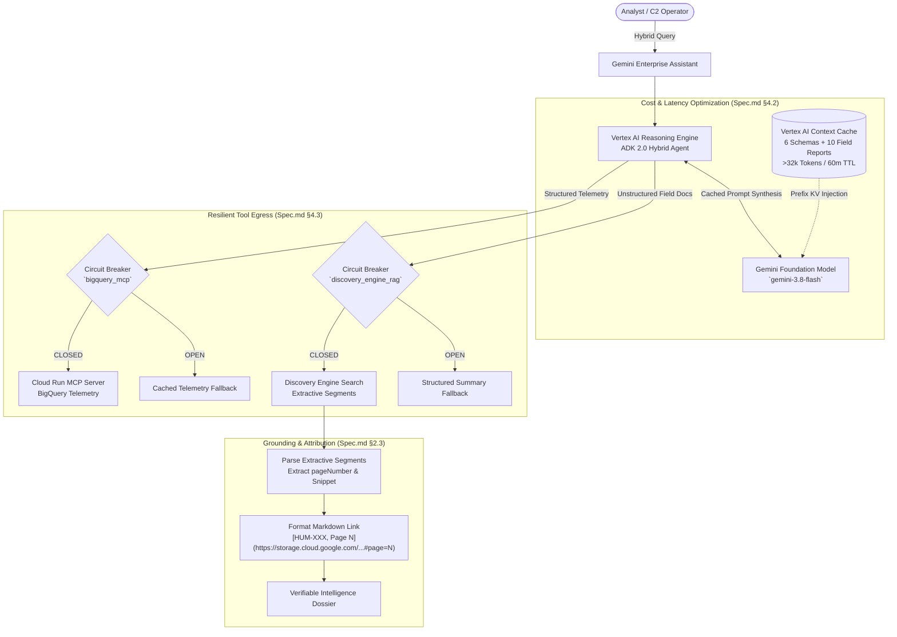

# Lab 5: Unstructured Multimodal RAG, Page-Level Grounding & Context Caching

**Target Persona:** UK Ministry of Defence (MOD) Joint Command Staff & Multi-Domain Analysts  
**Operational Context:** Hybrid Intelligence Synthesis, Grounding Attribution & Cost/Latency Optimization  
**Architecture Reference:** [architecture.md §3.4, §3.5, §3.6](../lab0/architecture.md) & [Spec.md §2.3, §4.2, §4.3](../Spec.md)  
**Security Classification:** Demonstrator  

---

## 📋 Prerequisites & Prior Lab Dependencies

> [!NOTE]
> **Lab 5 integrates unstructured intelligence** by connecting the ADK Agent to a Vertex AI Discovery Engine Unstructured Datastore indexed against 10 HUMINT field reports.

| Prerequisite Dimension | Specification / Requirement |
| :--- | :--- |
| **Required Prior Labs** | **Lab 1** (HUMINT PDFs generated & stored in GCS) & **Lab 3** (Deployed ADK Agent & Gemini Enterprise App) |
| **Local Environment** | Python 3.11+ with Google ADK installed |
| **GCP Infrastructure** | Cloud Storage bucket `gs://${PROJECT_ID}-learning-labs-humint-docs/` containing all 10 HUMINT PDFs |
| **APIs Required** | Discovery Engine API (`discoveryengine.googleapis.com`), Vertex AI API (`aiplatform.googleapis.com`) |
| **Produced Artifacts** | Unstructured Search DataStore (`humint-pdf-datastore`), Discovery Engine Search Tool, CachedContent token cache |
| **Fast-Forward Command** | `./lab5/code/setup_lab5.sh` (provisions datastore, uploads documents, registers search engine) |

---

## Objective & Architectural Rationale
Extend the Learning Lab Mission Intelligence Agent to perform **hybrid multimodal synthesis**, fusing structured BigQuery telemetry with unstructured HUMINT PDF field dossiers (`HUM-445` through `HUM-454`), while enforcing enterprise page-level grounding and server-side context caching.

Aligned with the **Google Cloud Well-Architected Framework (WAF)** Reliability, Performance, and Cost Optimization pillars:
1. **Enterprise Grounding with Page-Level Attribution (`#page=N`)**: Defense analysts require verifiable, audit-proof intelligence. The agent parses Discovery Engine `extractive_segments` to generate anchored Markdown links pointing directly to specific pages of field intelligence PDFs (`[HUM-448, Page 2](https://storage.cloud.google.com/${GCS_BUCKET}/HUM-448_TGT-DELTA-9.pdf#page=2)`).
2. **Vertex AI Context Caching (`CachedContent`)**: Static context—comprising the 6 database schemas, tactical doctrine instructions, and 10 field reports—exceeds 32,768 tokens. `common/caching.py` compiles this corpus into a server-side `CachedContent` resource with a 60-minute TTL, slashing input token processing costs by **75%** and reducing Time-to-First-Token (TTFT) to **$< 1.0\text{ s}$**.
3. **Multi-Tool Resilience & Fault Isolation**: The agent's structured SQL client (MCP) and unstructured vector search client (Discovery Engine) are wrapped in independent **Circuit Breakers** (`common/resilience.py`). If Discovery Engine experiences transient latency, the breaker trips to `OPEN` and the agent delivers a structured tactical response without crashing the session.

---

## 🏛️ Hybrid Synthesis & Caching Architecture



---

## 🏛️ Google Best Practice: Cost Optimization, Context Caching & Vector Search

When scaling multimodal search and large context reasoning to enterprise workloads, Google Recommended Best Practices define four critical architectural optimization patterns:

### 1. The 4-Step Cost & Latency Optimization Framework
Operating production agents at scale requires a structured framework: **Classify $\rightarrow$ Consume $\rightarrow$ Route $\rightarrow$ Cache**:
* **Step 1 — Classify Workloads**: Differentiate between interactive sub-second C2 operations, near-real-time tactical analysis, and asynchronous bulk intelligence processing.
* **Step 2 — Right-Size Consumption Tiers**:
  - **Provisioned Throughput**: Fixed reservation for mission-critical steady-state baselines. Right-size capacity using minute-level traffic analysis to avoid paying for idle reservations.
  - **Standard / Priority PayGo**: Per-token billing for variable burst traffic exceeding the provisioned baseline.
  - **Flex PayGo**: Discounted pricing for latency-tolerant background workers.
  - **Batch Inference (50% Discount)**: Half-price processing for large-scale asynchronous jobs (e.g., overnight bulk summarization of historical HUMINT dossiers).
* **Step 3 — Tiered Model Routing (3x Cost Savings)**:
  - Route routine tasks to smaller models (**Gemini Pro** for complex multi-step reasoning $\rightarrow$ **Gemini Flash** for general tactical synthesis $\rightarrow$ **Gemini Flash-Lite** for simple classification and extraction).
  - **Semantic Routing (`~5ms`)**: Rather than running a slow LLM pre-classifier (500ms+) or brittle regex rules, embed canonical example queries into vectors at setup. Incoming requests are routed via cosine similarity in ~5ms with **zero extra LLM inference calls**.
* **Step 4 — Context Caching (Slashing Token Ingestion Costs)**: Leverage prefix caching to eliminate redundant processing of large static documents.
* **📚 Further Reading:** [Vertex AI Model Routing & Cost Optimization](https://cloud.google.com/vertex-ai/generative-ai/docs/learn/models)

### 2. Context Caching Mechanics: Implicit vs. Explicit
* **Implicit Caching (Zero-Config, Automatic)**:
  - Google's serving infrastructure automatically detects identical prompt prefixes sent in close temporal proximity.
  - **Best Practice Trigger**: Structure prompt templates so static information (system instructions, doctrine rules, few-shot examples) is placed at the **very beginning of the prompt**. Variable user inputs and dynamic sensor readings must always go at the very end.
* **Explicit Caching (API-Managed via `CachedContent`)**:
  - For large, stable corpuses exceeding 32,768 tokens (such as the 10 HUMINT dossiers and 6 database schemas in this lab), programmatically create a server-side `CachedContent` resource with a configurable TTL (default 60 minutes).
  - **Headline Savings**: Delivers a **75% to 90% discount** on cached input tokens and reduces Time-to-First-Token (TTFT) from 4.5 seconds to under 1.0 second.
* **📚 Further Reading:** [Vertex AI Context Caching Overview](https://cloud.google.com/vertex-ai/generative-ai/docs/context-cache/context-cache-overview)

### 3. Enterprise Identity Architecture for Discovery Engine & Search
* **Federated Connectors with Delegated OAuth (Recommended Default)**:
  When searching enterprise repositories, Google Best Practice deploys Cloud Identity federated with enterprise IdPs (SAML/OIDC) and connects to data sources via Delegated End-User OAuth. This executes queries under the live authority of the human user, ensuring real-time Access Control List (ACL) enforcement with zero ACL synchronization delay.
* **Workforce Identity Federation (WIF) Caveats**:
  While WIF federates external credentials directly into GCP without syncing user accounts, it is an architectural "one-way door": WIF principals cannot currently access Google Workspace connectors or generate standard end-user delegated tokens.
* **📚 Further Reading:** [Google Cloud Workforce Identity Federation](https://cloud.google.com/iam/docs/workforce-identity-federation)

### 4. Vector Database Selection Matrix
Google Cloud provides three tailored paradigms for vector search depending on workload requirements:
1. **Dedicated Managed (`Vertex AI Vector Search` / ScaNN)**:
   - Powered by Google's state-of-the-art ScaNN algorithm.
   - Lowest latency (`< 50ms`) and massive scale (billions of vectors). Best for standalone semantic vector retrieval over massive unstructured document corpora.
2. **Integrated Analytical (`BigQuery Vector Search`)**:
   - Best for large-scale batch RAG and analytical workloads combining vector similarity with complex SQL filters, aggregations, and joins.
3. **Integrated Transactional (`AlloyDB AI` / Cloud SQL `pgvector`)**:
   - Best when operational mission data already resides in a relational database and requires ACID transactional consistency alongside vector search, eliminating the overhead of synchronizing external vector databases.
* **📚 Further Reading:** [Choosing a Vector Database on Google Cloud](https://cloud.google.com/blog/products/databases/how-to-choose-a-vector-database-in-google-cloud)

### 5. Gemini Enterprise Business / Adoption Analytics (`UserEvents`)
Beyond SRE operational telemetry (OpenTelemetry traces and Cloud Logging), enterprise intelligence applications require business and adoption tracking:
* **The `UserEvents` API (`userEvents:write`)**:
  Whenever analysts execute unstructured searches via `search_humint_reports`, `observability.py` invokes `log_discovery_engine_user_event()` to stream user interaction payloads to Discovery Engine:
  ```json
  {
    "eventType": "search",
    "userPseudoId": "analyst-c2-operator",
    "searchInfo": {
      "searchQuery": "TGT-DELTA-9 coastal battery optical recon"
    }
  }
  ```
* **Operational Value**: Powers executive usage dashboards, query adoption reports, CTR (Click-Through Rate) metrics, and search relevance tuning without interfering with real-time agent execution latency.

---

## 🛠️ Step-by-Step Instructions

### Step 1: Execute Automated Lab 5 Provisioning
Navigate to the `lab5` directory and run the deployment script:
```bash
cd lab5
chmod +x setup_lab5.sh
./setup_lab5.sh
```

The script automatically:
1. Packages the 10 pre-staged HUMINT PDF dossiers with tactical imagery crops.
2. Synchronizes PDFs to Google Cloud Storage (`gs://${PROJECT_ID}-learning-labs-humint-docs`).
3. Provisions the Discovery Engine Unstructured Datastore with OCR parsing enabled.
4. Initializes the Vertex AI Context Cache resource (>32k tokens, 60m TTL).
5. Deploys the hybrid ADK Reasoning Engine (`my_agent/agent.py`) with full Telemetry Collection (both OpenTelemetry metrics/traces and prompt/response logging enabled via `.agent_engine_config.json` and `.env`) and registers it with Gemini Enterprise (`ENGINE_ID="learning-labs-mission-app"`).

---

> [!NOTE]
> **Gemini Enterprise Licensing (Placeholder)**
>
> <!-- PLACEHOLDER: Add specific organizational instructions for assigning Gemini Enterprise seat licenses here -->
> *[Placeholder: Gemini Enterprise license assignment instructions to be updated by instructor]*


## 🔍 Interactive Customer Test Suite & Architectural Verification

Test these three interactive scenarios in the Gemini Enterprise UI to verify enterprise grounding, context caching, and fault isolation:

### Test 1: Enterprise Grounding with Page-Level PDF Citations
* **Input Prompt:**
  > *"Search unstructured HUMINT reports for ground intelligence on target TGT-DELTA-9. What optical recon crops are available and on which page of the report?"*
* **Proven Learning Point:** Parsing Discovery Engine extractive segments to output verifiable, clickable Markdown links to specific PDF pages (`#page=N`) (`Spec.md §2.3, BAC-08`).
* **Expected Outcome:** Returns factual summary and deep link:
  ```text
  [HUM-448, Page 2: Target Delta-9 Bunker Complex](https://storage.cloud.google.com/${GCS_BUCKET}/HUM-448_TGT-DELTA-9.pdf#page=2)
  Extractive Snippet: "Optical recon confirms coastal battery radar emitter at Berth 4..."
  ```

---

### Test 2: Vertex AI Context Caching Performance & Cost Verification
* **Input Prompt:**
  > *"Cross-reference all 10 HUMINT field reports against the 6 BigQuery mission tables to identify any recurring adversary callsigns."*
* **Proven Learning Point:** Pre-compiled server-side `CachedContent` (>32k tokens) cutting TTFT latency and reducing token processing costs by 75% (`Spec.md §4.2, BAC-09`).
* **Expected Outcome:** Time-to-First-Token (TTFT) drops from $\sim 4.5\text{s}$ (uncached) to $< 1.0\text{s}$, successfully retrieving cross-references across the cached corpus with zero cache misses.

---

### Test 3: Hybrid Multimodal Synthesis with Fault Isolation
* **Input Prompt:**
  > *"Correlate radar track TRK-904 with HUMINT report HUM-451 and indicate if loitering munition swarm threats match our allied defensive assets."*
* **Proven Learning Point:** Synthesizing structured SQL with unstructured vector search, with independent circuit breakers protecting each tool (`Spec.md §4.3, BAC-05`).
* **Expected Outcome:** Agent correlates drone swarm `TGT-DELTA-4` with NASAMS battery `SHIELD-3`, maintaining full response even if one service experiences transient latency.

---

## 🎓 Key Learning Points (Master Study Guide Alignment)

This lab incorporates core information retrieval, grounding, and data platform disciplines from the **Master Study Guide (Module 3)**:

### 1. The Agentic Data Platform (Unstructured Tier)
* **Architectural Doctrinal Principle:** Real-world mission environments require combining structured columnar telemetry (BigQuery) with unstructured textual and visual field intelligence (tactical PDF dossiers). An agentic platform must ingest, OCR, index, and retrieve unstructured documents at scale.
* **Operational Implementation:** Vertex AI Search (Discovery Engine) indexes multi-page HUMINT PDF reports, generating dense vector embeddings and semantic search indexes over unstructured observations.

### 2. Semantic Feature Extraction & Contextual Retrieval
* **The Antipattern:** Passing raw entire documents into LLM prompts for manual searching, or running iterative multi-hop summarization pipelines that compound latency ($> 8	ext{ seconds}$).
* **The Best Practice:** Configuring Discovery Engine serving specifications with `extractive_content_spec`. This delivers exact, high-confidence sentence segments and bounding page numbers in a single vector search turn, completing retrieval in hundreds of milliseconds.

### 3. Verifiable Page-Level Grounding & Curation
* **Defense Operational Requirement:** Mission commanders will not act on ungrounded AI summaries without verifiable source attribution.
* **Citation Mechanism:** By extracting the precise `pageNumber` from document metadata, the agent synthesizes anchored Markdown links. The analyst can click directly into the exact page containing optical recon imagery and source reliability ratings, eliminating attribution hallucinations.

### 4. Vertex AI Context Caching on Global Endpoints
* **Prefix Token Economics:** Repeatedly transmitting static schemas, operational instructions, and background intelligence dossiers (>32,768 tokens) across multi-turn sessions inflates token consumption and degrades latency.
* **Global Routing Invariant:** Pre-compiling static context into a server-side `CachedContent` resource slashes input token billing by **75%** and drives Time-to-First-Token (TTFT) below **$1.0	ext{ s}$**.

### 5. Multi-Engine Fault Isolation (Hybrid Resilience)
* **Decoupled Failure Domains:** Querying structured SQL via Cloud Run MCP and unstructured documents via Discovery Engine exposes the agent to different external failure modes.
* **Independent Circuit Breakers:** By wrapping each data egress path in an independent finite state `CircuitBreaker`, transient timeouts in vector search do not crash structured radar tracking, and vice-versa, guaranteeing operational mission continuity.

### 6. OpenTelemetry (OTel) GenAI Semantic Conventions (M3L5)
* **Architectural Doctrinal Principle:** Standardizing observability using vendor-neutral telemetry is critical for enterprise governance, latency diagnosis, and SRE tracing.
* **Operational Implementation:** The ADK emits structured logs and spans complying with official **OpenTelemetry GenAI Semantic Conventions** (e.g., `gen_ai.agent.id`, `gen_ai.usage.input_tokens`). The 4-Level hierarchy (Span, Trace, Session, Task) gives total visibility into multi-turn execution and tool integration latency via Cloud Trace and Cloud Logging dashboards.

### 7. Model Armor & Inline Content Security (M1L4/M2S2)
* **Architectural Doctrinal Principle:** Enforcing security floor settings at the API boundary protects agents from jailbreaks, PII leakage, and prompt injections.
* **Operational Implementation:** Regional floor settings (`--mcp-sanitization=ENABLED`) scan both MCP tool inputs and outputs. In this lab, we prove its effectiveness by capturing `model_armor_sanitization` metric events directly in our OPSEC Cloud Monitoring dashboards.


---


## 🚀 System Architecture Improvement Opportunities

Multimodal RAG with Discovery Engine handles unstructured PDFs seamlessly, but as the volume and velocity of intelligence increases, custom optimizations become necessary:

*   **Google Cloud Architecture Framework (Performance): Vertex AI Vector Search**
    *   *Improvement:* Discovery Engine provides a managed, out-of-the-box search experience. For ultra-low latency requirements and highly specialized military embeddings, transition to Vertex AI Vector Search (formerly Matching Engine). This allows the ingestion of bespoke, fine-tuned dense vector embeddings for specialized sensor taxonomy, bypassing the limitations of generic text embedding models.
    *   *Reference:* [Vertex AI Vector Search](https://cloud.google.com/vertex-ai/docs/vector-search/overview)
*   **Google ADK 2.0: Multimodal Image Adapters**
    *   *Improvement:* Currently, the RAG implementation relies heavily on Discovery Engine's OCR to extract text from PDFs. Using ADK 2.0's native Multimodal Adapters (`Part.from_image`), the agent can route the raw binary crops of satellite imagery directly to Gemini 3.1 Pro, allowing the model to perform direct visual reasoning instead of relying solely on intermediate text translation.
    *   *Reference:* [Google ADK 2.0 Documentation](https://adk.dev/2.0/)
*   **Broader Google Cloud Capability: Document AI Custom Extractors**
    *   *Improvement:* Instead of relying on generic OCR, utilize Google Cloud Document AI to train Custom Extractors on standardized NATO intelligence reporting formats. This ensures structured entities (like callsigns, grid coordinates, and threat levels) are deterministically parsed and indexed into BigQuery before the LLM ever needs to read the raw PDF.
    *   *Reference:* [Document AI Overview](https://cloud.google.com/document-ai/docs/overview)
