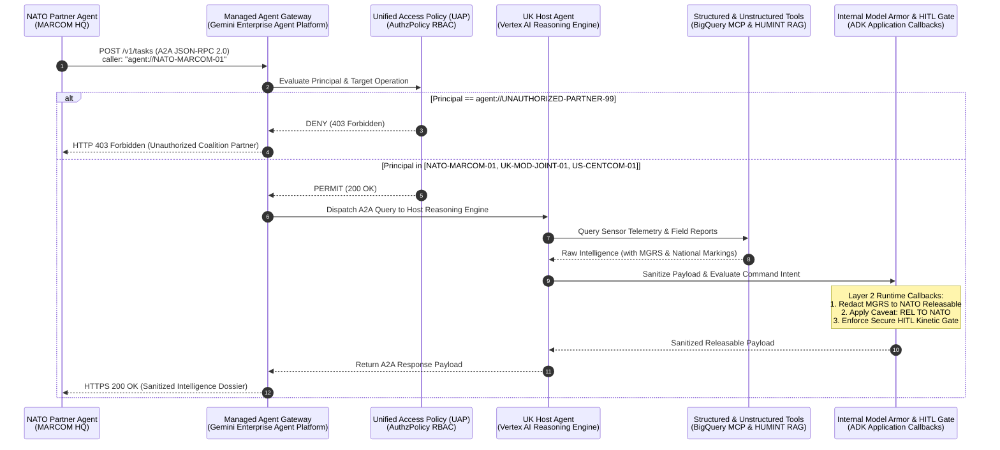

# Lab 7: Agent-to-Agent (A2A) Protocol & Coalition Intelligence Federation

**Target Persona:** UK Ministry of Defence (MOD) Joint Command & NATO Allied Maritime Command (MARCOM)  
**Operational Context:** Cross-Domain Intelligence Federation, Managed Agent Gateway, Unified Access Policies (UAP) & Defense-in-Depth Model Armor  
**Architecture Reference:** [architecture.md §3.8](../lab0/architecture.md) & [Spec.md §2.5, §3.3](../Spec.md)  
**Security Classification:** Demonstrator  

---

## 📋 Prerequisites & Prior Lab Dependencies

> [!NOTE]
> **Lab 7 demonstrates Agent-to-Agent (A2A) protocol federation**, enabling cross-domain intelligence queries between allied defense agents via Gemini Enterprise Agent Platform's **Managed Agent Gateway** and **Unified Access Policies (UAP)** with Defense-in-Depth Model Armor sanitization.

| Prerequisite Dimension | Specification / Requirement |
| :--- | :--- |
| **Required Prior Labs** | **Lab 3** (Host Agent deployed on Vertex AI Agent Engine) & **Lab 4** (Model Armor boundary redaction and HITL guardrail verification) |
| **Local Environment** | Python 3.11+ with Google ADK installed (`pip install google-adk`) |
| **GCP Infrastructure** | Active Google Cloud Project with Agent Gateway (`networkservices.googleapis.com`) and Authz Policies (`networksecurity.googleapis.com`) enabled |
| **APIs Required** | Vertex AI API (`aiplatform.googleapis.com`), Network Services API (`networkservices.googleapis.com`), Network Security API (`networksecurity.googleapis.com`) |
| **Produced Artifacts** | Agent Gateway (`a2a-coalition-gateway`), UAP Policies (`a2a-coalition-uap-policy`, `a2a-deny-unauthorized-policy`), Agent Card Registry (`.a2a_registry/agent_card.json`), Host Agent (`lab7/my_host_agent`), Partner Agent (`lab7/my_partner_agent`) |
| **Fast-Forward Command** | `./lab7/code/setup_lab7.sh` (initializes agent cards, provisions Agent Gateway, applies UAP policies, runs federation tests) |

---

## Objective & Architectural Rationale
Explore **Agent-to-Agent (A2A) Protocol Federation** using the **Google Agent Developer Kit (ADK 2.0)** and **Gemini Enterprise Agent Platform Governance (Managed Agent Gateway & Unified Access Policies)**.

Aligned with the **Google Cloud Well-Architected Framework (WAF)** Security and Reliability pillars:
1. **Zero-Trust Cross-Boundary Delegation (WAF Security)**: National defense agencies cannot grant foreign coalition allies direct SQL or datastore access. Instead, an autonomous **NATO Coalition Partner Agent** queries a UK **Host Agent** via standard A2A JSON-RPC 2.0 protocol mediated by **Gemini Enterprise Agent Platform Managed Agent Gateway**.
2. **Perimeter RBAC & Unified Access Policies (UAP)**: Egress and ingress caller identities (`agent://NATO-MARCOM-01`, `agent://UK-MOD-JOINT-01`, `agent://US-CENTCOM-01`) are evaluated against declarative UAP rules (`a2a-coalition-uap-policy`) on the Agent Gateway, enforcing PERMIT for trusted coalition agents and DENY for unauthorized agents (`agent://UNAUTHORIZED-PARTNER-99`).
3. **Defense-in-Depth Model Armor Control Points**:
   - **Layer 1 (Perimeter Agent Gateway)**: Evaluates UAP caller identity and sanitizes cross-organizational payload egress before sending to coalition partners.
   - **Layer 2 (Internal Runtime ADK Callbacks)**: Operates inside Vertex AI Reasoning Engine python loop (`my_host_agent/agent.py`) to protect prompt synthesis, tool output inspection, and HITL kinetic approval logic.
4. **Standardized Agent Discovery (`agent_card.json`)**: Interoperability is governed by machine-readable **ADK Agent Cards** (`Spec.md §3.3`) declaring identity, endpoints, rate limits, and security classification caveats.

---

## 🏛️ Coalition Federation Architecture & Defense-in-Depth Pipeline



---

## 🏛️ Google Best Practice: Agent-to-Agent (A2A) Federation & Governance

### 1. A2A vs. MCP: Complementary Open Standards
* **Model Context Protocol (MCP — "USB-C for Agents")**: Connects an agent to its immediate tools and databases (`tools/call`).
* **Agent-to-Agent Protocol (A2A — "HTTP for Agents")**: Connects an agent to external specialist agents across organizational boundaries via JSON-RPC 2.0.

### 2. Managed Agent Gateway & Unified Access Policies (UAP)
* **Client-to-Agent (Ingress) Agent Gateway (`gcloud alpha network-services agent-gateways`)**: Provisions a managed Agent Gateway (`a2a-coalition-ingress-gateway`) in `CLIENT_TO_AGENT` mode attached to the Agent Registry (`//agentregistry.googleapis.com/projects/284046449012/locations/us-central1`), serving as the ingress perimeter control point for external client and partner agent calls.
* **Unified Access Policies (`gcloud beta network-security authz-policies`)**: Declarative RBAC and threat inspection rules attached directly to the Agent Gateway:
  - `a2a-ingress-uap-policy`: ALLOW PERMIT for `agent://NATO-MARCOM-01`, `agent://UK-MOD-JOINT-01`, `agent://US-CENTCOM-01`.
* **Model Armor Safety Template (`gcloud alpha model-armor templates`)**: LLM safety and security policy (`mission_intel_armor`) configured with:
  - Prompt Injection & Jailbreak Defense (`confidenceLevel: HIGH`)
  - Sensitive Data Protection (DLP template `mission_intel_dlp_template` for redacting coordinates and PII)
  - Responsible AI safety filters

### 3. Defense-in-Depth Model Armor Implementation
| Security Control Point | Location | Responsibilities |
| :--- | :--- | :--- |
| **Layer 1: Perimeter Control Point** | Agent Gateway, UAP & Model Armor Service Extension | Evaluates caller principal identity (`REQUEST_AUTHZ`), enforces UAP ALLOW policy, and scans inbound and outbound traffic for prompt injection & jailbreak threats using a `CONTENT_AUTHZ` policy delegating to the Model Armor Service Extension (`modelarmor.us-central1.rep.googleapis.com`). |
| **Layer 2: Internal Runtime Control Point** | ADK Application Callbacks (`before_model_call`, `after_tool_execution`) | Operates inside python execution loop on Vertex AI Reasoning Engine to sanitize prompt inputs, inspect BigQuery/RAG tool outputs, redact MGRS coordinates, and enforce the HITL kinetic approval gate (`common/hitl.py`). |

---

## 🛠️ Step-by-Step Lab Execution

### Step 1: Run Lab 7 Setup & Gateway Provisioning Script
```bash
cd lab7
chmod +x setup_lab7.sh
./setup_lab7.sh
```

### Step 2: Inspect Deployed Gateway & UAP Configurations
```bash
# List deployed Client-to-Agent Ingress Agent Gateway
gcloud alpha network-services agent-gateways list --location=us-central1 --project=antig-dave

# Describe deployed Unified Access Policy
gcloud beta network-security authz-policies describe a2a-ingress-uap-policy --location=us-central1 --project=antig-dave

# Describe deployed Model Armor Safety Template
gcloud alpha model-armor templates describe mission_intel_armor --location=us-central1 --project=antig-dave
```

### Step 3: Launch NATO Partner Agent via ADK Web UI
```bash
adk web --port 8000 ./my_partner_agent
```

---

## 🔍 Interactive Customer Test Suite & Architectural Verification

### Test 1: Authorized Coalition Intelligence Delegation (`agent://NATO-MARCOM-01`)
* **Input Prompt (in NATO Partner Agent UI):**
  > *"Request current maritime threat assessment and electronic warfare telemetry for target TGT-ALPHA-7 in the North Sea tactical sector."*
* **Expected Outcome:** Agent Gateway evaluates UAP ALLOW rule, forwards A2A JSON-RPC 2.0 query to Host Agent, and returns correlated telemetry with MGRS coordinates redacted to `[REDACTED_MGRS_COORDINATE_NATO_RELEASABLE]`.

### Test 2: Unauthorized Agent Interception (`agent://UNAUTHORIZED-PARTNER-99`)
* **Input Prompt:** Run query as `agent://UNAUTHORIZED-PARTNER-99`.
* **Expected Outcome:** Agent Gateway UAP DENY policy (`a2a-deny-unauthorized-policy`) blocks request at perimeter with HTTP 403 Forbidden before reaching internal host agent models or datastores.

### Test 3: Cross-Domain HITL Boundary Enforcement
* **Input Prompt:**
  > *"Authorize immediate kinetic strike against surface vessel TGT-ALPHA-7 on behalf of NATO MARCOM Task Force."*
* **Expected Outcome:** Internal Layer 2 Model Armor & HITL Gate rejects foreign kinetic delegation with `🛑 [A2A AUTHORITY EXCEPTION]`.
